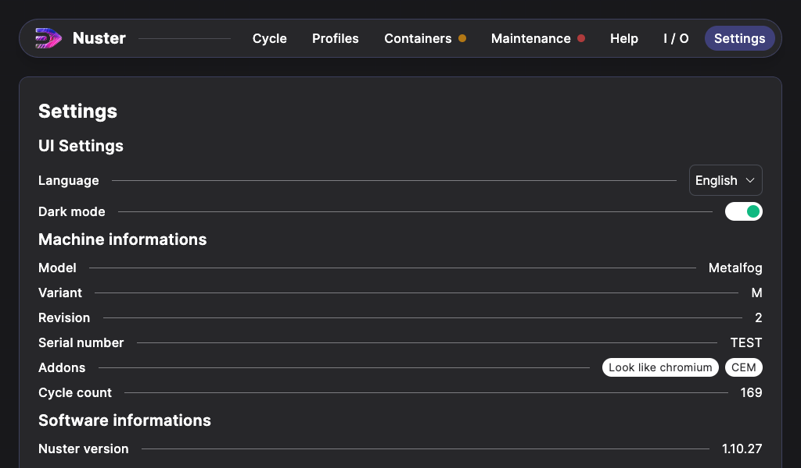

## Settings section

### General description

This section displays all of your machine details, and tweak some settings.

You can edit :

- Software language,
- Dark mode / Bright mode.

You can also view:

- The model,
- The variant,
- The revision,
- The serial number,
- Machine options,
- Machine cycle count,
- Software informations,
- Network settings.

A last sub-section is available: `Advanced settings`, this sub-section is reserved for **METALIZZ* and its partners.

### Updates

When an updated is availble, it will be automatically downloaded to your machine if its connected to the network. An `Update` button is available to install the update. Click on the buton and it will be installed automatically.
