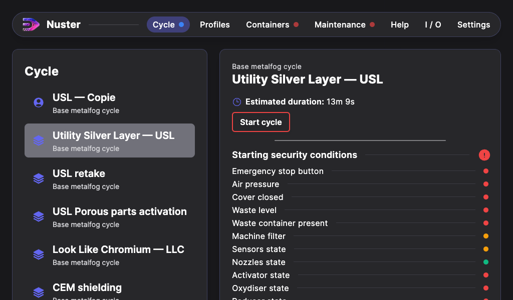
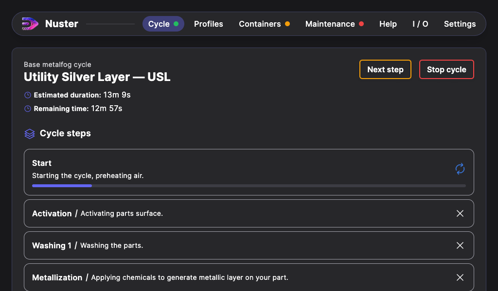

## Cycle section

### General description

This section handles machine cycles. In the left list, you can find these elements:

- User cycles: marked with a blue icon `user`.
- Primary Manufacturer cycles: marked with a blue icon `manufacturer`.
- Secondary Manufacturer cycles: marked with a blue icon `manufacturer`.

When you select a cycle, the main section displays informations about this cycle.

- Name of the used cycle, here: `Base metalfog cycle`
- Name of the used profile, here: `Utility Silver Layer — USL`,
- Cycle estimated duration, here: `13m 9s`,
- The `Start cycle` button,
- Starting security conditions to start the cycle.

#### Starting conditions

The Starting security conditions can have 3 states:

- **Green** : Good to go,
- **Orange** : Warning (The cycle can be started, but its result is not guaranteed),
- **Red** : Impossible to start (Required action).

When all theses conditions are good to go, then the start cycle button `Start cycle` goes to green.

### Running cycle

When a cycle is running, its progress is displayed in the main section.

#### Cycle informations

In the upper section, you will find :

- Name of the used cycle,
- Name of the used profile,
- Cycle estimated duration,
- Cycle remaining duration,
- A `Stop cycle` button.

#### Cycle steps

In the `Cycle steps` section, each step is displayed with:

- Its name,
- A breive description,
- Its progress, if its running,
- Its state:
  - Gray X Mark: Not executed,
  - Spinning arrows: Current running step,
  - Orange Arrow: Skipped or early exited step,
  - Green checkmark: Ended step.

#### Additional informations

For some machines, an `Additional informations` section can be added over the cycles steps. This section can display additional informations such as:

- `Temperature` for an Thermoregulated USCleaner.

### Cycle end

Once the cycle has ended, the main section display the following informations:
"Cycle has ended. Finished successfully"

This page, help to know if the cycle has ended successfuly et know its total duration.

If this page shows an end reason other than "Finished successfully", then the end reason help you to understand what went wrong.

The steps resumé, also helps to understand what happened.

Validate the cycle end using the button `Complete cycle`.

> Congratulations! You have successfully completed a cycle with help from nuster !
