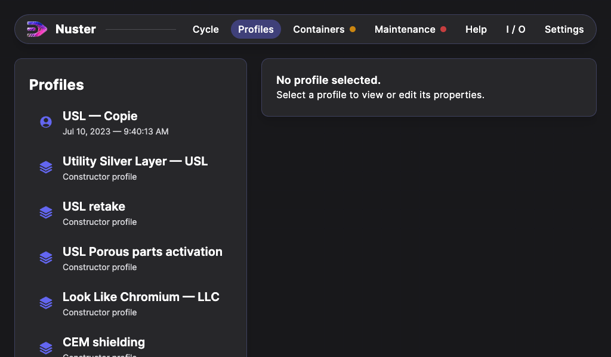
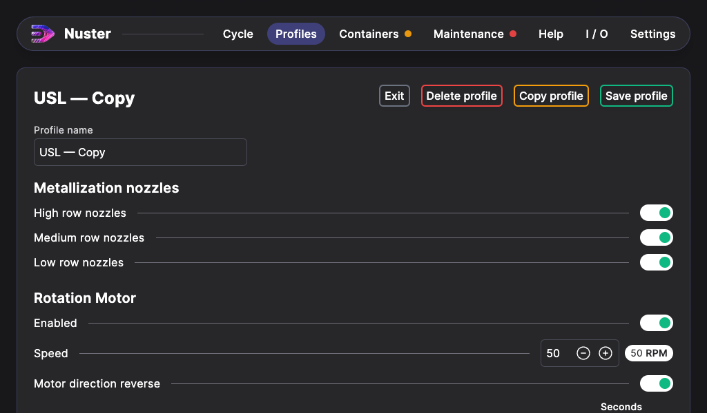

## Profile section

### General description

The profile section, handles profile creation and editing.

### Profiles list

There is 2 profile categories:

- User profiles:
  - with a `user` icon
  - subtitled with the last modification date
- Manufacturer profiles
  - with a `manufacturer` icon
  - subtitled with `Constructor profile`

The manufacturer profiles are neither removable or editable. But its possible to duplicate the profile to a new one, that is editable.

To view or edit a profile, select the profile in the left list. Its content will be displayed in the main section.

### View / Edit a profile

When the profile is displayed, the left list is hidden. You can then edit the profile settings.

Once all the modifications are set, click on the `Save profile` to save it. A green confirmation message is displayed over the profile name when its saved.

You can also:

- Delete the profile: By clicking on the `Delete profile` button, click back on the button to confirm the profile deletion.
- Copy the profile: the profile will be copied appended by " - Copy" in its name.

To leave the profile, click on the `Exit` button.
