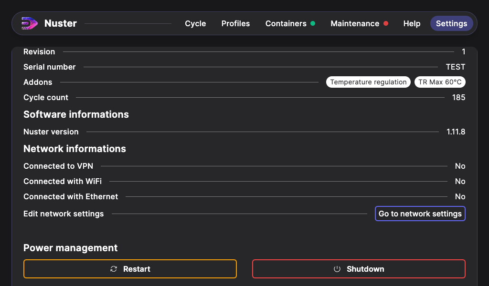
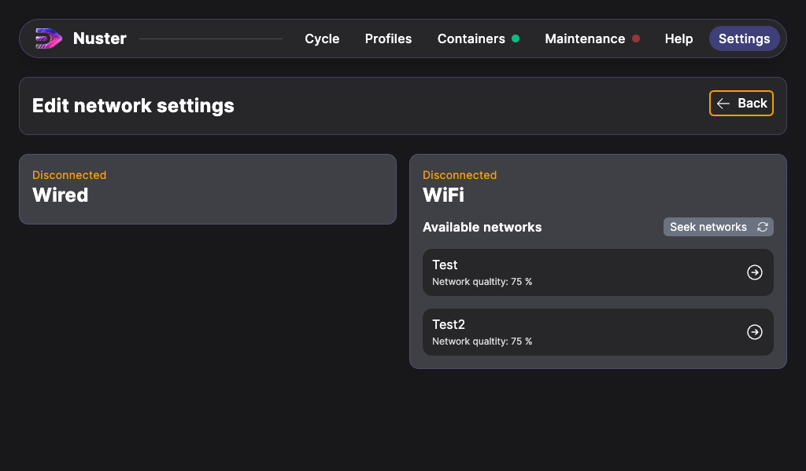
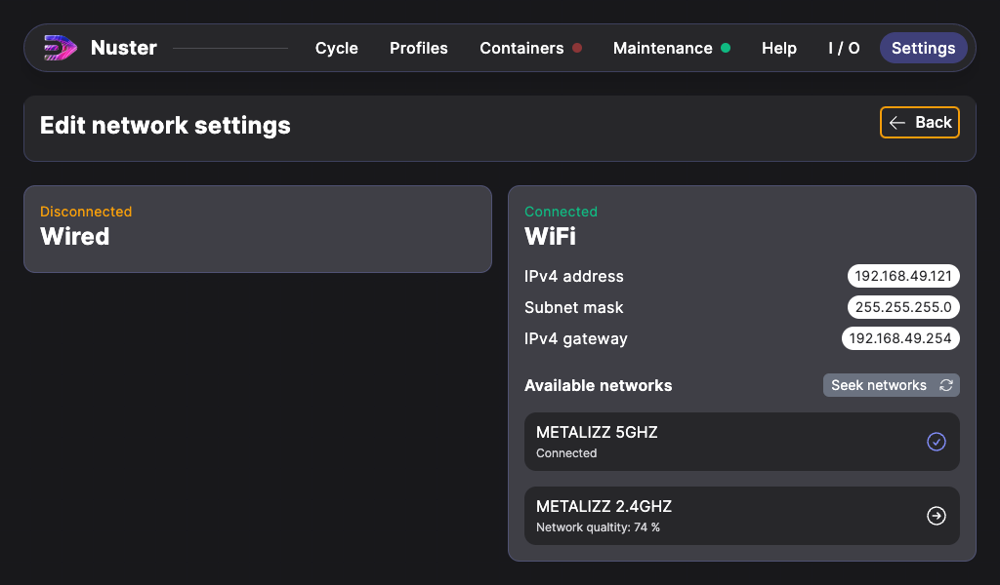

## Networking informations

To allow remote maintenance on your machine, you juste have to connect it to internet, you can use the following methods:

- Connecting the RJ45 Jack located under the electric box.
- A Wifi network

> Warning: For now, it's not possible to set a static IPv4 address.

This network connection has some access requirements :

| Port | Description |
| --- | --- |
| 443 TCP | Allow remote connection to BalenaCloud VPN |
| 123 UDP | For NTP time synchronization |
| 53 UDP | For DNS name resolution |

Additionally, you should allowlist the following domains for the relevant ports above:

- *.balena-cloud.com

No direct connection is established between your device and our services. All conections are tunneled using a VPN.

### Wifi connection

Since Nuster 1.12.1, your machine can connection to Wifi networks. Click on the `Settings` tab to go to these settings.

Click on `Go to network settings`.

You can find here the 2 interfaces of your machine. The Wired interface, ony displays informations about its connectivity.

For the Wireless interface, it draws the available networks. The network list refreshes itself automaticaly, you can refresh the list manually by pressing the `Seek networks` button.

Click on the network you want to connect to. If the network is secured, a password will be asked.

