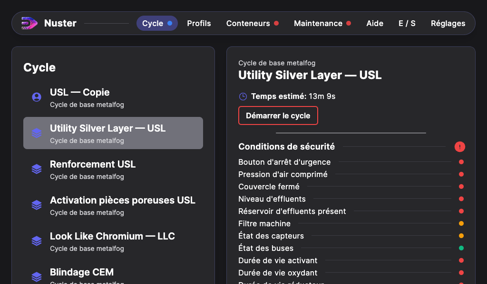
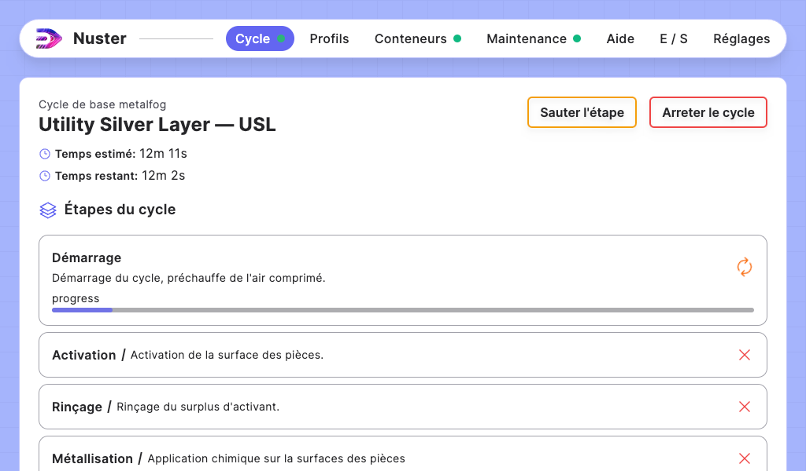
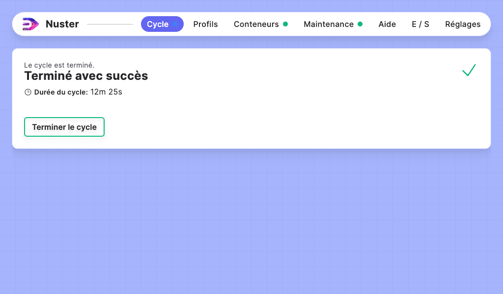

## Section — Cycle

### Description de la section

Cette section permet de gérer les cycles machines. Dans la liste de gauche vous trouverez différents éléments:

- Cycles utilisateurs: Marqués par un pictogramme bleu `utilisateur`
- Cycles constructeur principaux: Marqués par un pictogramme bleu `contructeur`
- Cycles constructeur secondaires: Marqués par un pictogramme rose `contructeur`

Lorsque vous avez sélectionné un cycle, la partie principale affiche les informations de ce cycle.

- Le nom du cycle utilisé, ici `Cycle de base metalfog`
- Le nom du profil utilisé, ici `Utility Silver Layer — USL`
- Le temps estimé, ici `12m 11s`
- Le bouton pour démarrer le cycle
- Les conditions de sécurité pour démarrer le cycle

#### Conditions de sécurité

Les conditions de sécurité peuvent avoir 3 états:

- **Vert**: OK pour lancer
- **Orange**: Avertissement, le cycle peut être lancé mais son résultat n'est pas garanti.
- **Rouge**: Impossible de lancer

Si les états pour lancer un cycle le permettent alors le bouton `Démarrer le cycle` passe au vert.

### Cycle en cours

Lorsque le cycle est en cours, dans la partie principale apparait le déroule du cycle.

#### Informations du cycle

Dans la partie haute, vous trouverez:

- Le nom du cycle
- Le nom du profil utilisé
- Le temps estimé
- Le temps restant
- Un bouton `Arreter le cycle`

#### Étapes du cycle

Dans la partie `Étapes du cycle`, chaque étape est représentée par:

- Son nom
- Sa description
- Sa progression, si elle est en cours
- Son statut:
        - Croix rouge: Pas encore executée
        - 2 Fleches tournantes: Étape en cours
        - Coche verte: Étape terminée

#### Informations additionnelles

Pour certaines machines, une rubrique `Informations addtionnelles`, peut être présente au dessus des étapes du cycle, elle peuvent donner par exemple `la température du bac` pour un USCleaner.

### Cycle terminé

Une fois le cycle terminé, La partie principale affiche le contenu suivant:

Cette page contient diverses informations:

- La raison de fin du cycle
- La durée totale du cycle

Si la raison de fin du cycle est autre que `Terminé avec succès` alors le cycle ne s'est pas terminé correctement. La raison de fin donne des détails sur ce qui à causé la fin du cycle.

Validez la fin du cycle avec le bouton `Terminer le cycle`.

> Vous venez de réaliser votre premier cycle à l'aide de Nuster, félicitations !
