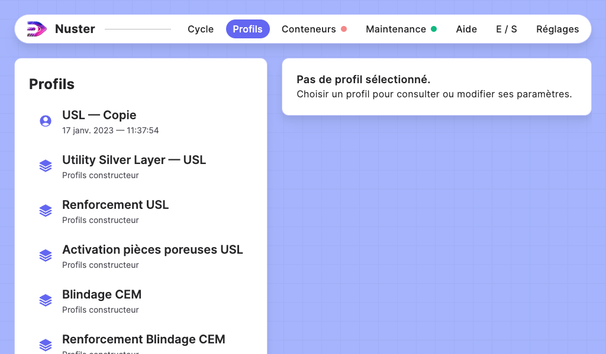
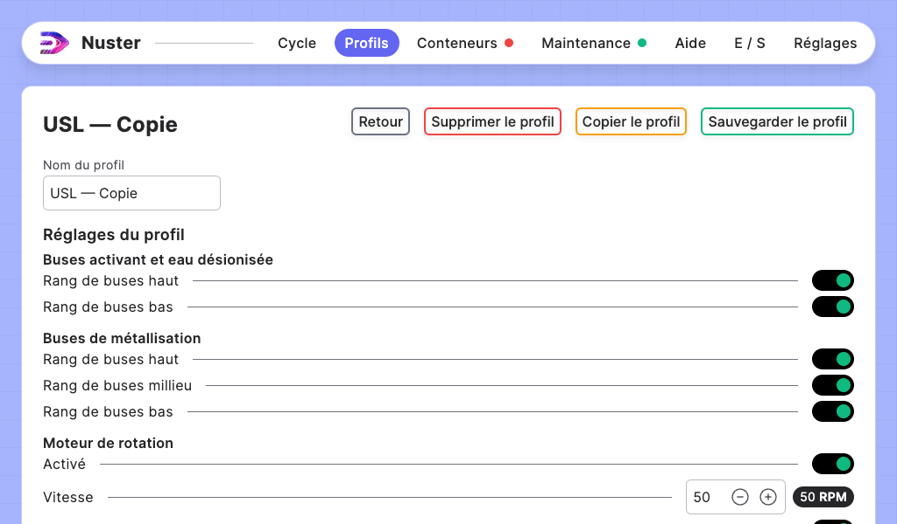

## Section — Profils

### Description de la section

La section profil vous permet de modifier les profils de votre machine.

### Liste des profils

Vous pouvez voir ici 2 catégories:

- Profils utilisateurs:
	- marqués à l'aide du pictogramme `utilisateur`.
	- sous titrés avec la date de leur dernière modification.
- Profils constructeur:
	- marqués à l'aide du pictogramme `constructeur`.
	- sous titrés avec `profils contructeur`

Les profils constructeur ne sont pas supprimables ni modifiables. En revanche, vous pouvez les copier pour modifiers certains paramètres en fonction de votre utilisation de la machine.

Pour consulter ou modifier un profil, cliquez simplement sur le profil que vous souhaitez consulter ou modifier dans la liste de gauche. 

### Consultation / Modification d'un profil

Une fois le profil ouvert, la liste de gauche se masque pour laisser place aux détails du profil. Vous pouvez alors modifier les réglages du profil.

Une fois les paramètres modifiés, cliquez sur le bouton `Sauvegarder le profil` pour le sauvegarder.  Un message de confirmation apparait au dessus du nom du profil lorsque celui-ci est sauvegardé.

Vous pouvez aussi:

- Supprimer le profil: Cliquez sur le boutton "Supprimer le profil", une confirmation vous sera demandée pour éviter les erreurs de suppression.
- Copier le profil: Le profil sera copié avec un suffixe " — Copie " dans son nom.

Pour quitter la modification / consultation du profil, cliquez sur `Retour`.
