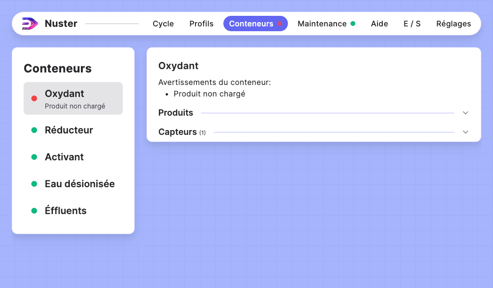
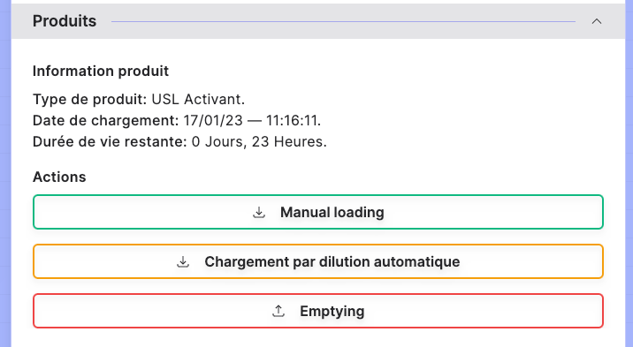
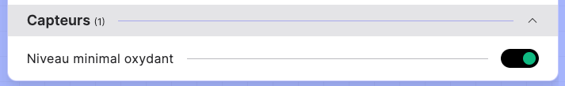
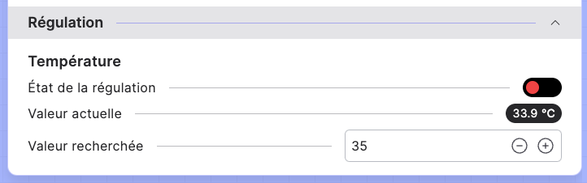

## Section — Conteneurs

### Description de la section

Cette section permet de gérer les conteneurs de votre machine:

- L'affectation des produits chargés dans les conteneurs
- Les capteurs affectés à ces conteneurs
- Les régulations affectés à ces conteneurs

Chaque conteneur possède des configuration différentes, certains conteneurs n'ont pas d'affectation de produits, d'autres n'ont pas de capteurs assignés et quelques-un ont des régulations attitrées.

### Gestion du produit

#### Informations produit

Lorsqu'un produit est chargé dans la machine, les informations suivantes sont disponibles: 

- Le type de produit chargé
- La date de chargement du produit
- La durée de vie restante pour un produit optimal

> **Avertissement:** Certains produits n'ont pas de durée de vie. Le conteneur affichera donc un avertissement.

#### Actions produit

Grâce à ces actions vous pouvez charger et vidanger les produits soit automatiquement soit manuellement. Vous serez guidé par le logiciel pour le chargement du produit dans votre machine.

> **Avertissement:** Certaines actions peuvent vous renvoyer vers l'exécution de cycles nécessaires à leur finalisation.

### Capteurs

Dans cette sous-section, vous trouverez les différents capteurs assignés au conteneur.

### Gestion des regulations

Vous pouvez modifier la consigne en modifiant la `Valeur recherchée` et activer la régulation en changeant `l'État de la régulation`. 

>**Avertissement:** La régulation est indépendante des cycles, elle continue automatiquement en arrière plan.