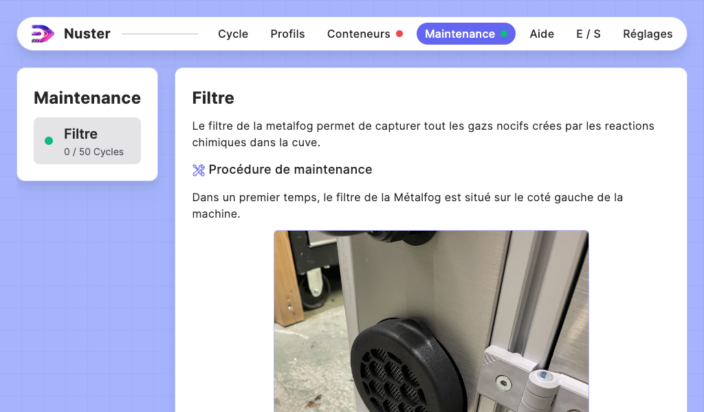

## Section — Maintenances

### Description de la section

Cette section permet de gérer les taches de maintenance de vos machines.

Chaque tache de maintenance est disponible dans la liste de gauche. Son état est indiqué avec une pastille de couleur:

- Vert: La maintenance n'est pas à prévoir
- Orange: La tache de maintenance est à prévoir (> 75%)
- Rouge: La tache de maintenance est à effectuer

Cliquez sur une tache pour afficher la tache de maintenance en question.

### Procédure de maintenance

Chaque tache de maintenance est accompagnée de sa procédure.

A la fin de la procédure de maintenance vous, trouverez le bouton de validation de la tache de maintenance qui remettra le compteur à 0.

### Avertissement: Maintenance rattachés à un capteur

Certaines taches de maintenance sont assignées à la mesure d'un capteur.

>Exemple: Le filtre de l'USCleaner.

Le statut de cette tache de maintenance dépend de l'état du capteur. Valider la tache de maintenance sans avoir effectué le remplacement du filtre n'aura donc aucun effet sur son statut.
