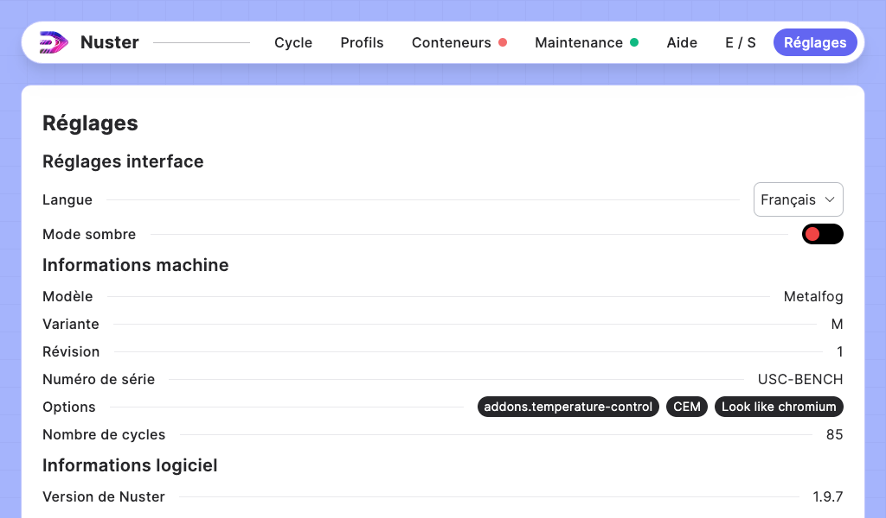

## Section - Réglages

### Description générale - Onglet Réglages

Cette section permet de consulter les différents détails de votre machine et d'en ajuster certains réglages.

Vous pouvez ainsi modifier :

- La langue de l'interface,
- L'utilisation du mode sombre / mode clair.

Vous pouvez aussi consulter différentes informations machine telles que :

- Le modèle
- La variante
- La révision
- Le numéro de série
- Les options
- Le nombre de cycles
- Les informations logiciel
- Les informations réseau

Une dernière rubrique est disponible :  `Réglages avancés`, cette rubrique est réservée aux interventions de **METALIZZ** et à ses sociétés partenaires.

### Mises à jour

Lorsqu'une mise à jour est disponible pour votre machine, une ligne   `Mise à jour` apparait dans les informations logicielles avec un bouton pour installer la mise à jour. Cliquez sur le bouton et la mise à jour s'installera automatiquement.
