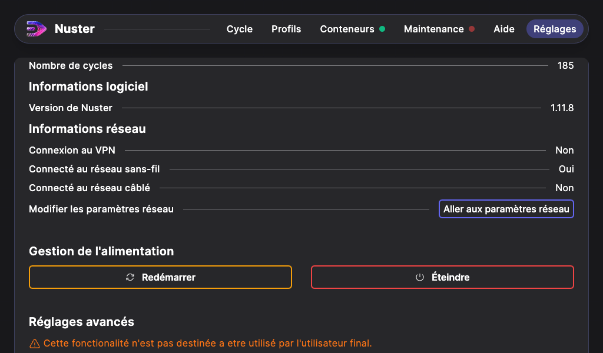

## Informations réseau

Pour permettre la télémaintenance de votre machine, il suffit de la connecter à votre réseau via soit:

- Le port RJ45, situé sous le coffret électrique.
- Un réseau wifi.

> Attention: Pour l'instant, il n'est pas possible d'assigner une addresse IPv4 Fixe a la machine.

Cette connexion réseau nécessite l'accès aux ports sortants suivants :

| Port | Description |
| --- | --- |
| 443 TCP | Permet la connexion VPN Balena-Cloud |
| 123 UDP | Pour la synchronisation de la date et l'heure |
| 53 UDP | Pour la résolution DNS |

Elle nécessite aussi l'accès au domaine suivant:

- *.balena-cloud.com

Aucune connexion directe entre la machine et nos services n'est possible. Toutes les connexions sont sécurisées via un VPN.

### Connexion en WiFi

Depuis Nuster 1.12.1, votre machine peux se connecter à des réseaux WiFi. Rendez vous dans l'onglet `Réglages`.

Cliquez sur `Aller au paramètres réseau`.

Vous trouverez ainsi les deux interface réseau de votre machine. L'interface RJ45, affiche uniquement des informations sur sa connectivité.

Pour l'interface Wifi, elle affiche une liste des réseaux disponibles a proximité. La liste se recharge automatiquement, pour vous pouvez la recharger manuellement en cliquant sur `Rechercher`.

Cliquez sur le réseau auquel vous souhaitez vous connecter. Si le réseau est sécurisé, un mot de passe vous sera demandé.

