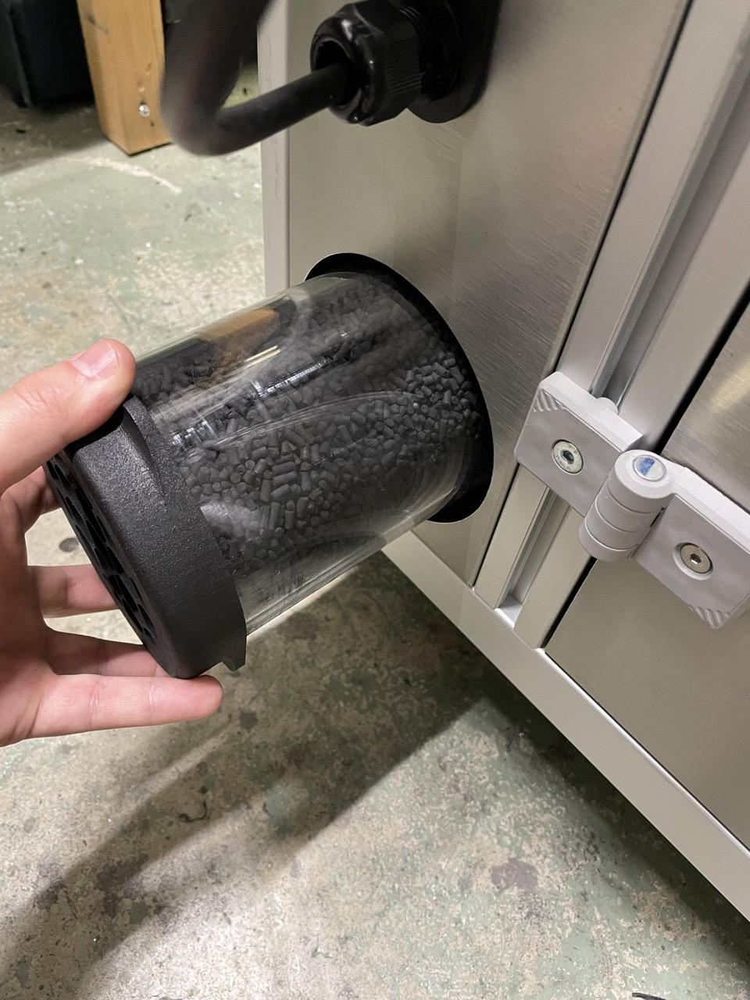

### Remplacement du charbon actif d'une cartouche filtrante

> Attention: Il est recommandé de changer les cartouches tout les 3 mois ou tout les 50 cycles.

Le filtre de la Metalfog est situé sur le côté gauche de la machine.

Dévissez le filtre en effectuant une rotation anti-horaire. Quand le filtre est libéré, sortez-le de son logement.

Uns fois sorti de son logement, remplacer le filtre, soit par un filtre neuf, soit en remplaçant le charbon actif contenu dans la cartouche filtrante.

#### Remplacement du charbon actif

> Ceci est la procédure pour le remplacement du charbon actif, veillez a porter des gants nitrile, une masque FFP3, et des lunettes de protection.

- Retirez les 3 vis maintenant le couvercle de la cartouche.
- Videz le charbon usagé (code déchet européen `06 13 02*` d'après la directive (UE) 2008/98/CE).
- Enlevez les filtres ronds des deux extrémités de la cartouche et remplacez-les par les filtres neufs fournis.
- Remplissez la cartouche avec le charbon actif neuf. Remettez le couvercle de la cartouche en replaçant bien les 3 vis.
