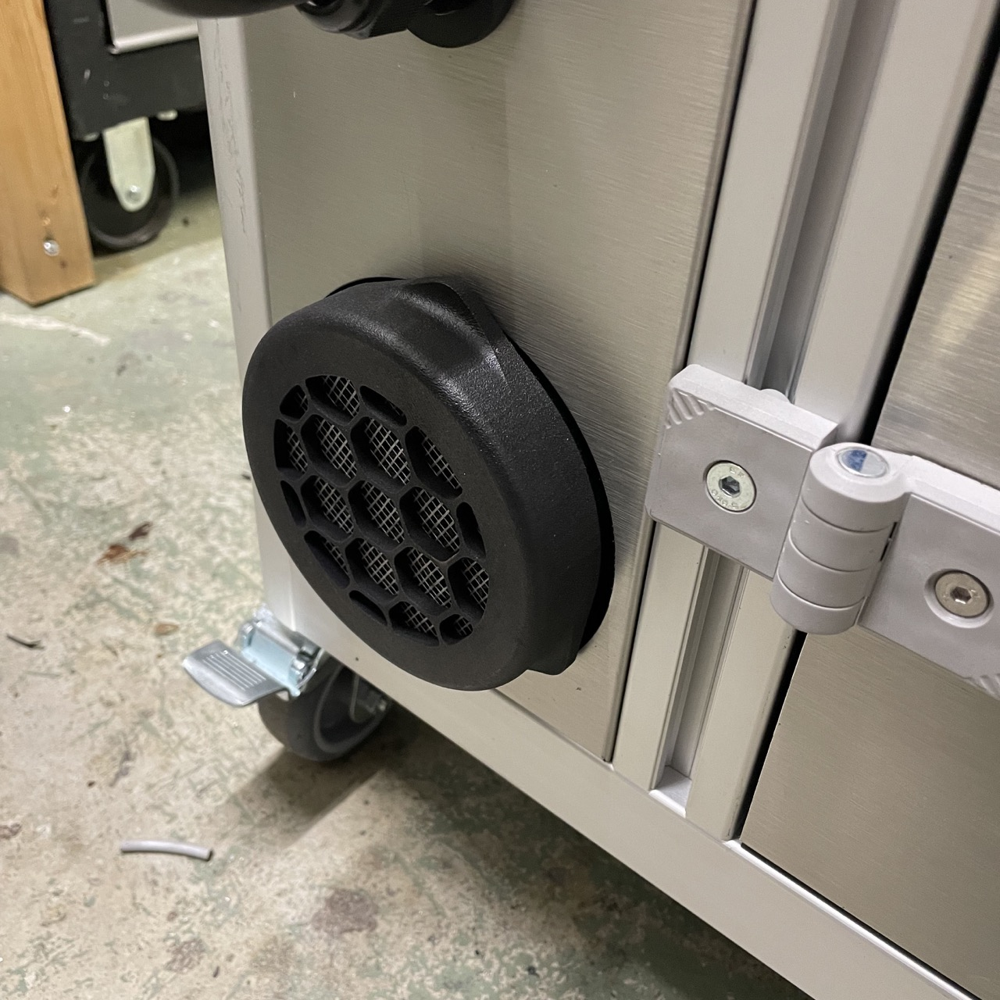
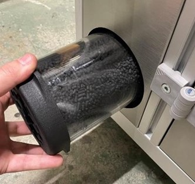

### Remplacement du charbon actif d'une cartouche filtrante

> **Attention** : Il est recommandé de changer les cartouches tous les 50 cycles ou bien dès que vous percevez une odeur d'ammoniaque.

Le filtre de la Metalfog est situé sur le côté gauche de la machine.

Dévissez le filtre en effectuant une rotation anti-horaire. Quand le filtre est libéré, sortez-le de son logement.

Une fois sorti de son logement, remplacez le filtre : soit par un filtre neuf, soit en remplaçant le charbon actif contenu dans la cartouche filtrante.

> En cas de remplacement du charbon uniquement, suivez les indications soit dans le meny de d'aide sur `Nuster` ou a la suite dans la documentation
