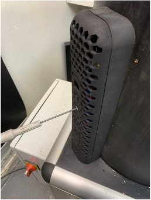
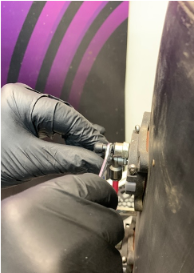
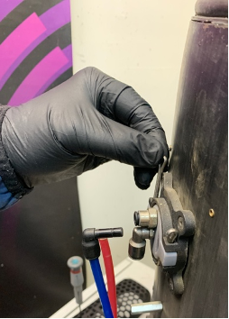
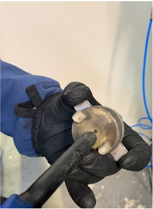

## Nettoyage des buses

> Attention: Les buses sont fragiles, manipulez-les avec précaution.

Localisez les carters des buses à l'arrière de la cuve, puis dévissez les deux vis M4 x 20 à l'aide d'un `Tournevis hexagonal T2.5`.

Une fois le carter retiré, extrayez les tubes reliés aux buses. Ces tubes sont maintenus grâce à des raccords instantanés.

Retirez les goupilles qui retiennent la buse en place.

Sortez la buse et nettoyez-la avec de l'`air comprimé`.

> Il est possible que lors du remontage d'une buse, l'entrée dans son support soit difficile. Il est recommandé d'ajouter de la graisse sur le joint autour de la buse. Il ne faut pas que de la graisse se retrouve à l'intérieur de la cuve : risque de pollution.

