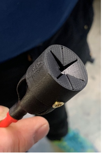
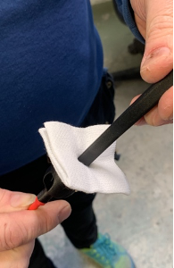
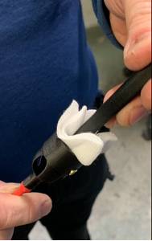
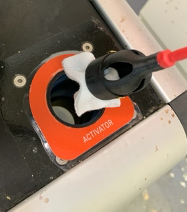
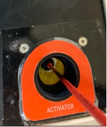

> Attention: Assurez vous que le conteneur de produit soit vide. 

> Le nettoyage des capteur se réalise a l'aide de l'outil `MF-OT-001`, vérifier sa propreté avant chaque nettoyage.

Sur l'outillage `MF-OT-001`, Monter une compresse 5 x 5. 

**Attention: utiliser uniquement des compresses, tout autre tissu ou papier essuie tout pourrait se désagréger dans le conteneur et boucher les buses.**

| 1 | 2 | 3 |
|--- |---|---|
| |||

Insérer l'outillage dans le conteneur.

Puis viser le capteur conique, situé au fond.

> Attention: Chaque compresse doit être unique a chaque conteneur. Des résidus chimiques pourraient dégrader les resultats des votre machine.

