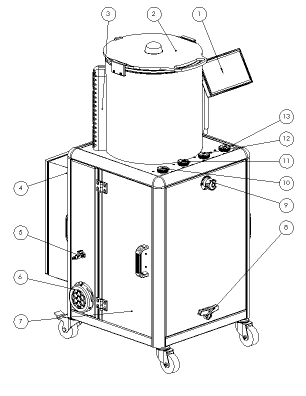
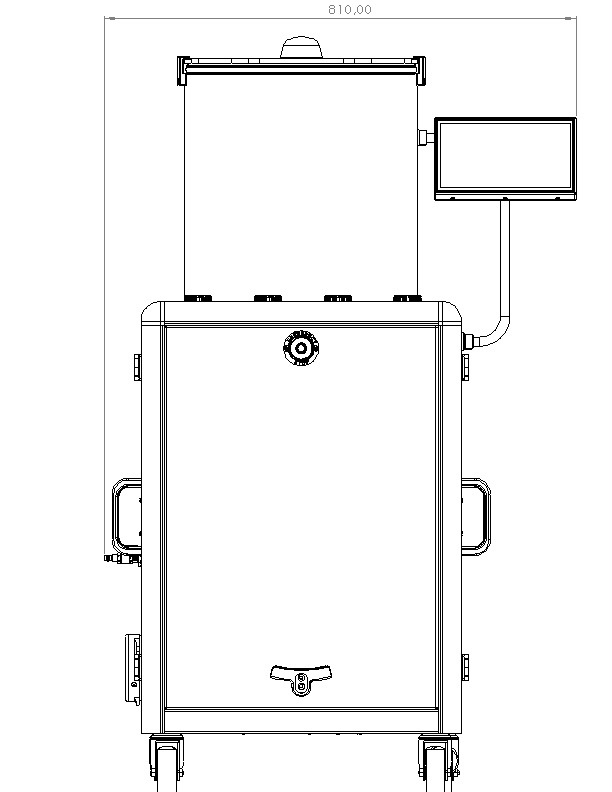
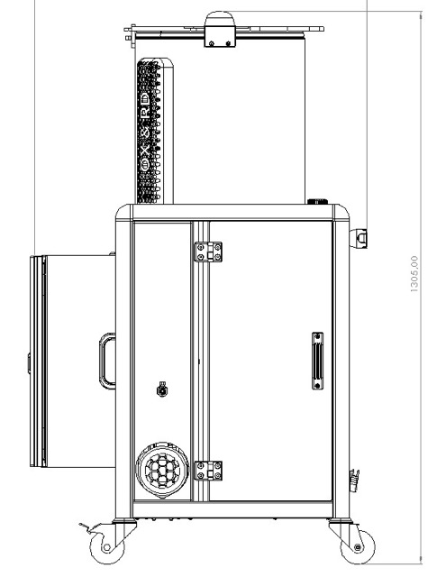
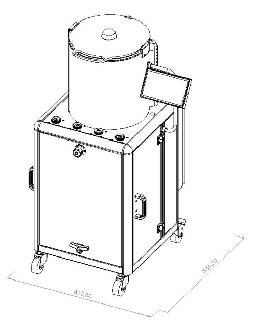

## Description des composants de la machine

### Composants

| Numéro | Description |
| ----- | ----- |
| 1 | Écran de contrôle |
| 2 | Couvercle |
| 3 | Cache de buses |
| 4 | Coffret électrique |
| 5 | Arrivée pneumatique |
| 6 | Cartouche filtrante à charbon actif |
| 7 | Porte d'àccès aux effluents |
| 8 | Support de couvercle |
| 9 | Conteneur d'Oxydant |
| 10 | Bouton d'ârret d'urgence |
| 11 | Conteneur de Réducteur |
| 12 | Conteur d'eau déionisée |
| 13 | Conteneur d'activant |

### Caractéristiques techniques

- Masse: 80 kg à vide
- Dimensions: 810 mm x 830 mm x 1350 mm
- Puissance max: 1.2 kW
- Débit d'air max: 600 L / min

### Dimensions

#### Vue de face

#### Vue de coté

#### Vue isométrique

