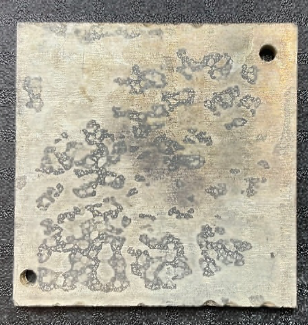
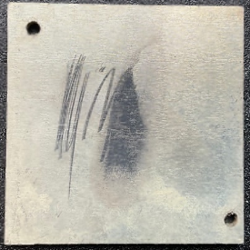
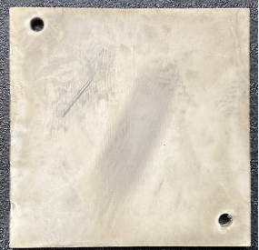

## Préparation des pièces

Les pièces à traiter avec la machine Metalfog doivent, au préalable, passer par des étapes de préparation afin de réussir et d’optimiser la qualité de la métallisation chimique.

Tout au long des étapes de préparation et durant le procédé de métallisation chimique, veillez à manipuler les pièces avec **des gants** afin d’éviter toute pollution de surface.

L’état de surface initial impacte la qualité du dépôt du primaire conducteur et la métallisation qui suit. Une surface polluée, mal dégraissée ou mal polymérisée entraine des défauts de métallisation chimique.

_Pièce métallisée présentant des défauts de mouillabilité

#### Préparation

1. Sablez les pièces (vivement conseillé) ;
2. Dépoussierez  à l'aide d'air comprimé ;
3. Nettoyez et dégraissez les pièces ;
4. Rincez les pièces à l'eau désionisée, de préférence dans un bac à ultrasons ;
5. Assurez-vous que les pièces soient bien propres grâce au test du film d'eau ;
6. Placez les pièces sur le montage approprié en veillant à respecter un écartement minimum de 10 à 15 mm entre chaque pièce.

|  |  |
| ---- | ---- |
| Pièce non sablée | Pièce sablée |

Le sablage permet d’améliorer l’adhésion du primaire conducteur au substrat. Cette étape n’est pas obligatoire, elle est cependant vivement conseillée pour obtenir des pièces très lisses.

Le nettoyage enlève les particules restantes à la surface des pièces.

Le dégraissage élimine les particules hydrophobes et permet d’obtenir une bonne mouillabilité de la surface.

Le rinçage à l’eau déionisée a pour but de retirer les traces résiduelles de dégraissant sur les pièces.