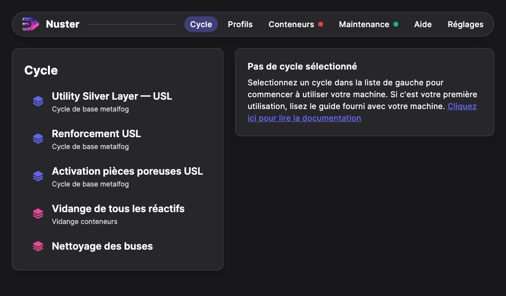
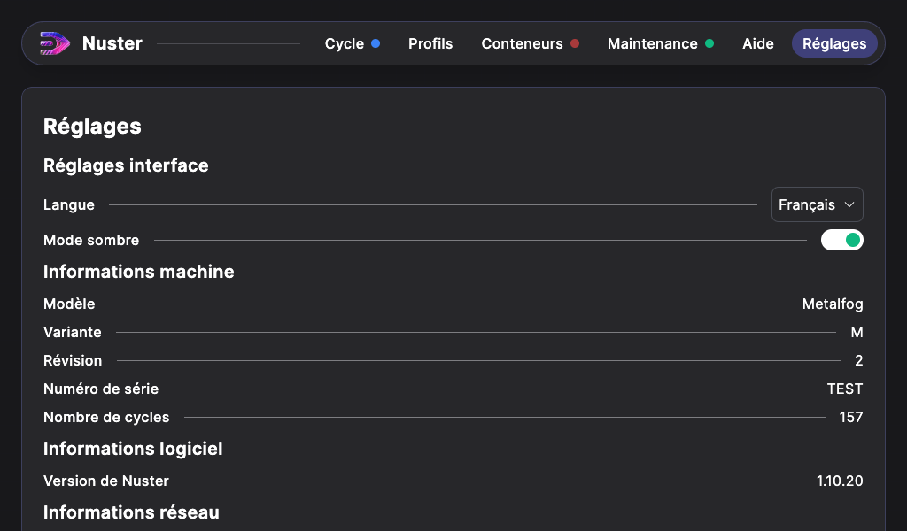
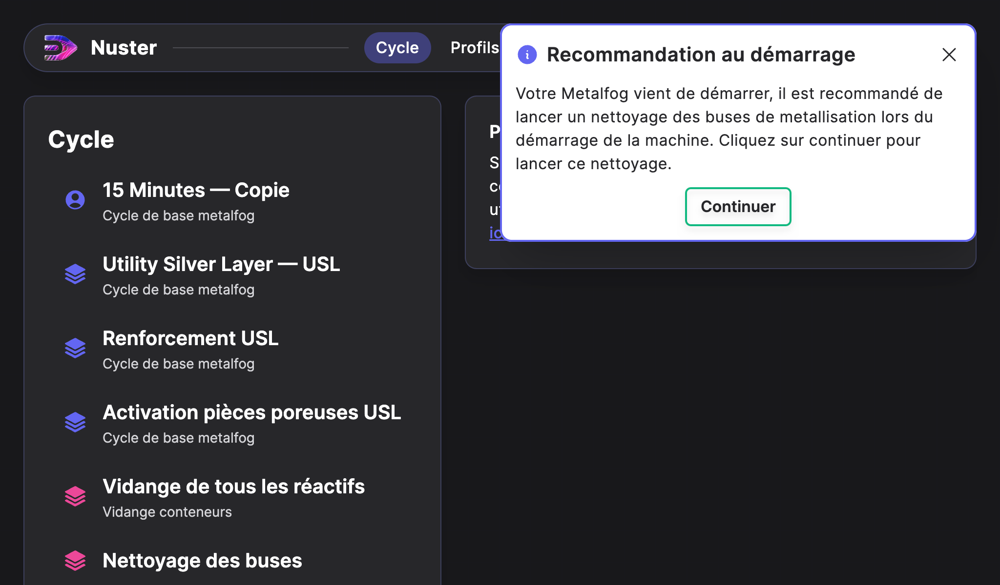
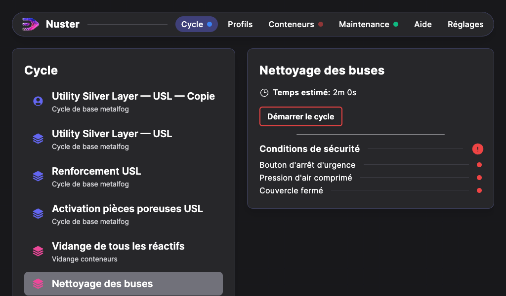

## Mise en route de la Metalfog

La Metalfog doit être installée dans un local équipé d’une Ventilation Mécanique Contrôlée (VMC) ou dans un local pouvant être aéré.

Une fois la Metalfog positionnée à son emplacement, bloquez les deux roulettes frein situées à l’avant de la machine.

#### Electricité

- Vérifiez que le câble et la fiche d’alimentation électrique sont en bon état.
- Reliez la machine au réseau 220V / 10A à l'aide câble d'alimentation.

#### Air comprimé

- Reliez la machine à un réseau d'air comprimé ou à un compresseur grâce au raccord ISO 6150 Type B situé sur la gauche de la machine.
- La pression doit être au minimum égale à 6 bars (0.6 MPa).
- Vérifiez que la vanne d’air comprimée est ouverte.

Vanne d'air comprimé ouverte

#### Mise en route

Vérifiez que le bouton d'arrêt d'urgence soit désenclenché.
Pour démarrer la machine, positionnez le sectionneur situé à l'arrière de la machine sur `I`, Le voyant `Sous tension` s'allume. 

## Interface logiciel

La Metalfog est pilotée grâce au logiciel Nuster. 
Une fois la machine en route, vous pouvez acccéder à ses fonctions avec l'écran tactile.

Il est possible de choisir entre 2 modes d'affichage : Clair ou Sombre. Pour cela, appuyez sur l'onglet "Réglages", puis sur le bouton de sélection du mode.

## Nettoyage des buses

Il est recommandé de lancer un nettoyage des buses de métallisation lors du démarrage de la machine.

Une boîte de dialogue s'affiche à l'écran après le démarrage de la Metalfog.

Appuyez sur "Continuer" dans cette boîte de dialogue puis lancez le cycle de nettoyage une fois que les conditions de sécurité sont validées (indicateurs au vert). Une fois le cycle fini, appuyez sur "Terminer le cycle" pour revenir au menu principal.

