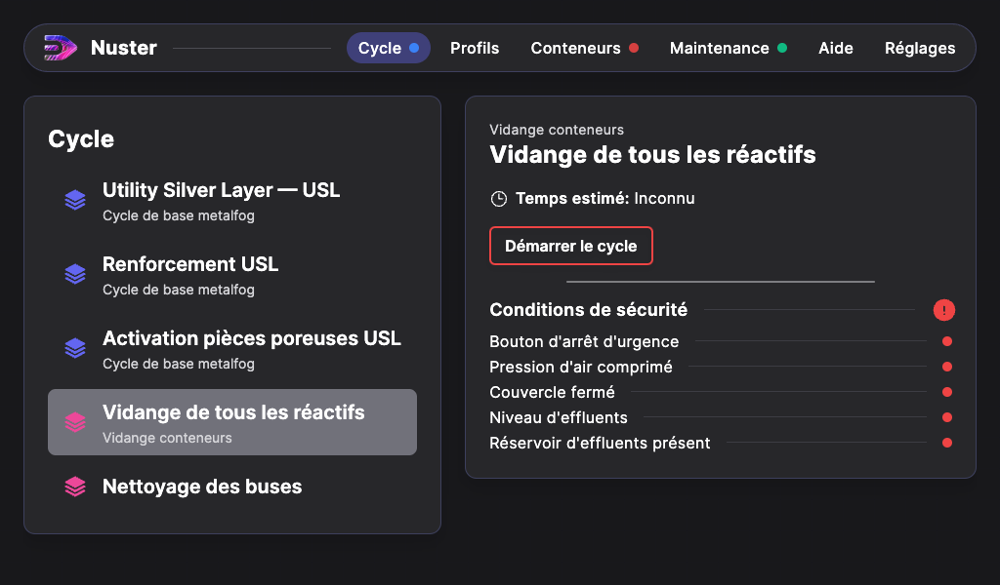
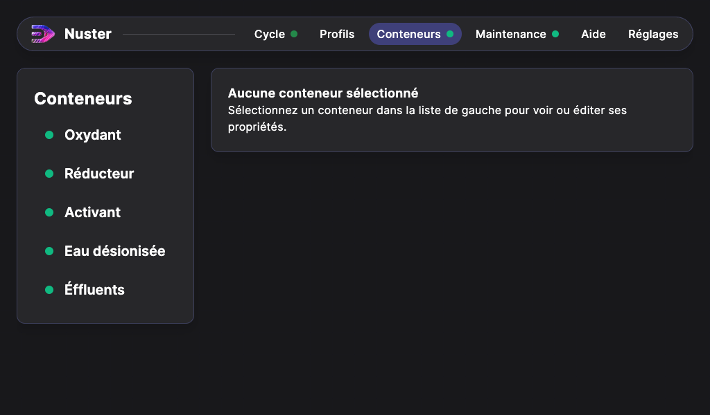
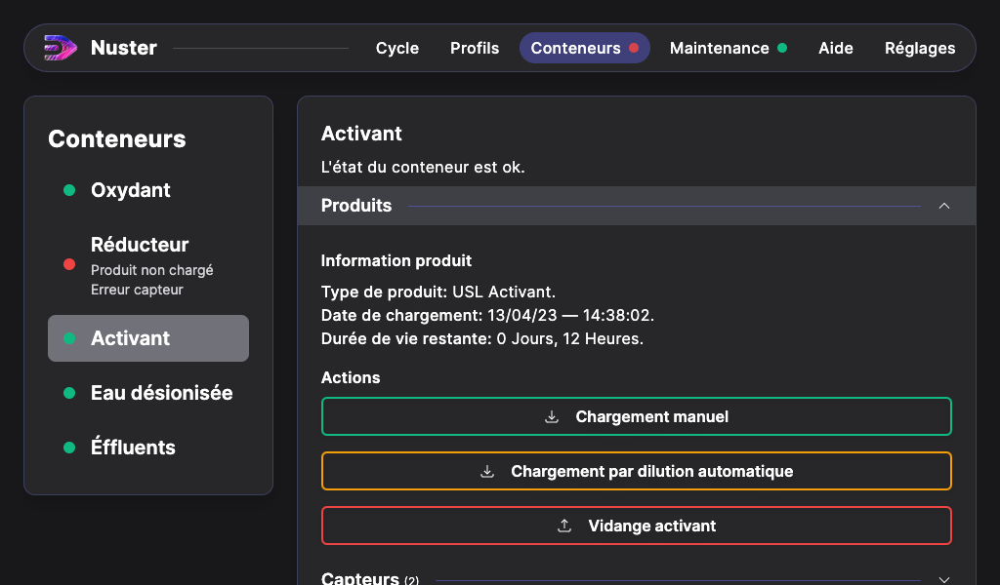
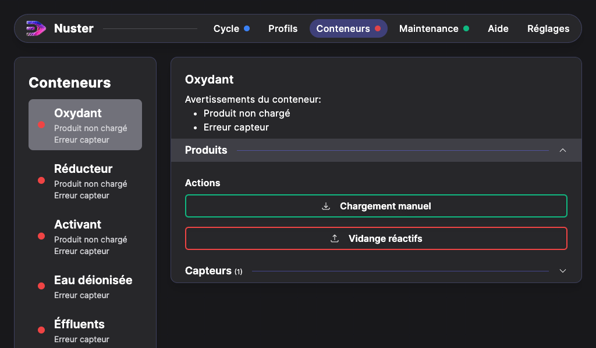
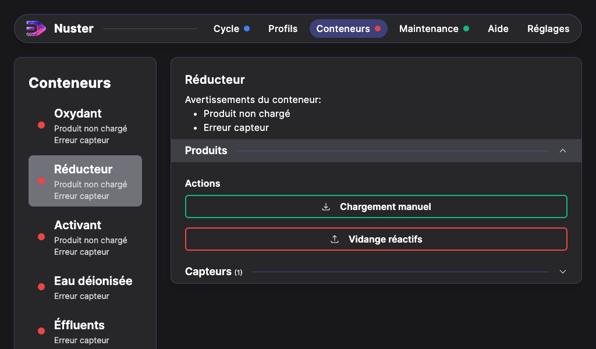

## Remplissage des conteneurs

Avant de manipuler les solutions chimiques, veillez à porter les EPI adéquats, en particulier : ***gants en nitrile, lunettes de protection et masque de protection FFP3 et à éviter tout contact avec la peau***.

Nous conseillons d’utiliser des entonnoirs pour éviter les salissures et les coulures de réactifs sur la Metalfog.

> **Attention** : Lors de la manipulation des réactifs Oxydants N°1 et N°2 et Réducteurs N°3 et N°4, il est capital d’utiliser des entonnoirs et des récipients propres et différents pour chaque type de produit.

> Les réactifs Oxydants et les réactifs Réducteurs ne doivent **JAMAIS** entrer en contact entre eux, même en infime quantité, au risque de compromettre la qualité du procédé de métallisation chimique.

Un kit Utility Silver Layer (USL) permet de réaliser 4 cycles parmi les cycles proposés : Utility Silver Layer - USL, Activation pièces poreuses USL, Renforcement USL. Une fois ouverts, les produits peuvent être conservés pendant 1 mois. 

Les dosages pour effectuer 1 cycle sont les suivants :

|      | Utility Silver Layer - USL | Activation pièces poreuses USL | Renforcement USL | 
| : ------ : | : ------ : | : ------ : | : ------ : | 
| N°0 USL ACTIVANT | 250 ml dilué à 2% (5 ml d'activant + 245 ml d'eau déionisée) | 250 ml dilué à 2% (5 ml d'activant + 245 ml d'eau déionisée) |   |
| N°1 USL OXYDANT | 125 ml |      |  125 ml  |
| N°2 USL OXYDANT | 125 ml|   | 125 ml | 
| N°3 USL RÉDUCTEUR | 125 ml|   | 125 ml | 
| N°4 USL RÉDUCTEUR | 125 ml|   | 125 ml | 

### Vérification de l'état des conteneurs

Avant de remplir les conteneurs de réactifs, vérifiez qu’ils sont bien vides.
Pour cela :

- Mettre le couvercle sur la machine.
- Aller à la page d’accueil de l’interface digitale.
- Appuyez sur l'onglet `Cycle`.
- Puis sur `Vidange de tous les réactifs`.

Avant que le cycle commence, la page des conditions de sécurité s’affiche (voir chapitre Vérification des conditions de sécurité).

Une fois lancé, laissez le cycle se terminer avant de revenir à la page d’accueil en appuyant sur `Terminer le cycle`. Ce cycle vide les conteneurs d'Activant, d'Oxydant et de Réducteur mais pas celui d'Eau déionisée.

### Remplissage Activant

Le bouchon du conteneur Activant est de couleur rouge (4ème bouchon en partant de la gauche). Le flacon contenant l'Activant, fourni par Metalizz, présente une étiquette rouge avec l’indication `N°0 UTILITY SILVER LAYER (USL) ACTIVANT`.

>**Attention** : Une fois dilué, l’activant se dégrade rapidement. La machine vous demandera automatiquement de le changer toutes les 12 heures.

Pour remplir le conteneur d'Activant, procédez ainsi :

- Cliquez sur `Conteneurs` dans les onglets en haut de l'écran.
- Puis sur `Activant`.
- Avant de remplir le conteneur de réactifs, vérifiez qu’il est bien vide afin de ne pas utiliser de produit dégradé. Appuyez sur `Capteurs` et vérifiez l'indicateur `Niveau minimal activant` : si l'indicateur est au vert le conteneur est vide, si l'indicateur est au rouge le conteneur ne l'est pas. Dans ce cas, appuyez sur `Produits` puis sur `Vidange réactifs` pour le vider.
- Dans le menu, appuyez alors sur `Produits` pour dérouler les choix de remplissage.

>**Attention** : Il existe 2 méthodes de remplissage de l'Activant : **dilution manuelle** ou **dilution automatique**, dans tous les cas l'Activant doit toujours être dilué à **2 %** dans de l'eau déionisée.

Sachant qu'une fois dilué, le produit  `N°0 UTILITY SILVER LAYER (USL) ACTIVANT` ne se conserve que 12 heures, le choix du mode de dilution de celui-ci dépendra de votre utilisation de la machine.
Si vous prévoyez de faire 4 cycles en 1 journée, alors la dilution automatique est conseillée. 
Si vous choisissez plutôt d'étaler l'utilisation sur plusieurs jours, la dilution manuelle est recommandée afin de ne pas gaspiller de réactifs.

**Exemples :**

**I)** 4 cycles prévus en 1 journée 

|       |  Lundi   |  Mardi   | Mercredi |  Jeudi   | Vendredi |  Samedi  | Dimanche| 
| : ---- : | : ---- : | : ---- : | : ---- : | : ---- : | : ---- : | : ---- : | : ---- : |
| Nbr de cycles | 4 |  |  |  |  |  |  |
 → Dilution automatique

**II)** 1 cycle/jour prévu sur 4 jours différents

|       | Lundi | Mardi | Mercredi | Jeudi | Vendredi | Samedi | Dimanche| 
| : ---- : | : ---- : | : ---- : | : ---- : | : ---- : | : ---- : | : ---- : | : ---- : |
| Nbr de cycles | 1 | 1 |  | 1 | 1 |  |  |
→ Dilution manuelle

**III)** 3 cycles/jour puis 1 cycle plus tard

|       | Lundi | Mardi | Mercredi | Jeudi | Vendredi | Samedi | Dimanche| 
| : ---- : | : ---- : | : ---- : | : ---- : | : ---- : | : ---- : | : ---- : | : ---- : |
| Nbr de cycles |  | 3 |  | 1 |  |  |  |
→ Dilution manuelle

#### Dilution manuelle

Pour effectuer un remplissage en faisant une dilution manuelle :

- Réalisez votre dilution à **2 %** de l'Activant grâce à une éprouvette graduée.

| Pour faire : | N°0 UTILITY SILVER LAYER ACTIVANT | EAU DÉIONISÉE |
| : ---- : | : ---- : | : ---- : | 
| 250 ml | 5 ml | 245 ml |
| 500 ml | 10 ml | 490 ml |
| 750 ml | 15 ml | 735 ml |

- Versez le produit `N°0 UTILITY SILVER LAYER (USL) ACTIVANT` dans l'eau déionisée et non l'inverse.
- Versez le mélange dans le conteneur d’Activant (4ème bouchon en partant de la gauche, de couleur rouge).
- Refermez le bouchon.
- Appuyez sur `Chargement manuel`.

#### Dilution automatique

Pour effectuer un remplissage en faisant une dilution automatique :

- Sélectionnez `Chargement par dilution automatique`.
- Versez 20 ml de produit `N°0 UTILITY SILVER LAYER (USL) ACTIVANT` dans le conteneur d’Activant (4ème bouchon en partant de la gauche, de couleur rouge).
- Laissez ouvert le conteneur d'Activant pour éviter une montée en pression.
- Appuyez sur `Démarrer le cycle`.
 Si les conditions de sécurité sont toutes validées (indicateurs au vert), la machine va automatiquement remplir le réservoir d'Activant avec de l'eau déionisée jusqu'à obtenir 1 L de mélange.
- Lorsque l'interface indique `Cycle terminé avec succès`, appuyez sur  `Terminer le cycle` pour revenir au menu principal.
- Refermez le conteneur avec son bouchon.

Une fois le conteneur rempli, la machine indique alors la date et l'heure du chargement et lance le décompte de durée de vie du réactif.

Si la quantité d'eau déionisée présente dans la machine est insuffisante pour terminer la dilution automatique, le cycle s'interrompt et un message d'erreur s'affiche. Appuyez sur `Terminer le cycle` pour revenir au menu principal. Remplissez le conteneur d'eau déionisée puis relancez un cycle de `Chargement par dilution automatique`.

### Remplissage Oxydant

Le bouchon du conteneur Oxydant est de couleur verte (1er bouchon en partant de la gauche). Les flacons d'Oxydant fournis par Metalizz présentent des étiquettes avec les indications `N°1 UTILITY SILVER LAYER` (étiquette bleue) et `N°2 UTILITY SILVER LAYER` (étiquette verte).

>**Attention** : Une fois mélangé, l’oxydant se dégrade rapidement. Il est conseillé de le changer au bout de 7 jours suivant sa préparation.

Pour remplir le conteneur d'Oxydant, procédez ainsi :

- Appuyez sur `Conteneurs` dans les onglets en haut de l'écran.
- Puis sur `Oxydant`.
- Avant de remplir le conteneur de réactifs, vérifiez qu’il est bien vide. Cliquez sur `Capteurs` et vérifiez l'indicateur `Niveau minimal oxydant` : si l'indicateur est au vert le conteneur est vide, si l'indicateur est au rouge le conteneur ne l'est pas. Dans ce cas, appuyez sur `Produits` puis sur `Vidange réactifs` pour le vider.
- Dans le menu, appuyez ensuite sur `Produits`.
- Munissez-vous des 2 flacons  `N°1 UTILITY SILVER LAYER` et `N°2 UTILITY SILVER LAYER`.
- Dans le conteneur Oxydant (1er bouchon en partant de la gauche, de couleur vert), versez, à l’aide d’un entonnoir propre, d'abord le produit `N°1 UTILITY SILVER LAYER` puis le produit `N°2 UTILITY SILVER LAYER`. Il est possible d'utiliser le même entonnoir pour les 2 produits.
- Appuyer sur `Chargement manuel`.

Une fois le conteneur rempli, la machine indique alors la date et l'heure du chargement et lance le décompte de durée de vie du réactif.

>Il faut toujours verser des quantités égales pour les réactifs oxydants et réducteurs :
Quantité `N°1 UTILITY SILVER LAYER OXYDANT` = Quantité `N°2 UTILITY SILVER LAYER OXYDANT` = Quantité `N°3 UTILITY SILVER LAYER RÉDUCTEUR` = Quantité `N°4 UTILITY SILVER LAYER RÉDUCTEUR`.

### Remplissage Réducteur

Le bouchon du conteneur Réducteur est de couleur blanche (2ème bouchon en partant de la gauche). Les flacons `Réducteur` fournis par Metalizz présentent des étiquettes avec les indications `N°3 UTILITY SILVER LAYER` (étiquette marron) et `N°4 UTILITY SILVER LAYER` (étiquette jaune).

>**Attention** : Une fois mélangé, le réducteur se dégrade rapidement. Il est conseillé de le changer au bout de 7 jours après préparation.

Pour remplir le conteneur Réducteur, procédez ainsi :

- Appuyez sur `Conteneurs` dans les onglets en haut de l'écran.
- Puis sur `Réducteur`.
- Avant de remplir le conteneur de réactifs, vérifiez qu’il est bien vide. Appuyez sur `Capteurs` et vérifiez l'indicateur `Niveau minimal réducteur` : si l'indicateur est au vert le conteneur est vide, si l'indicateur est au rouge le conteneur ne l'est pas. Dans ce cas, appuyez sur `Produits` puis sur `Vidange réactifs` pour le vider.
- Dans le menu, appuyez ensuite sur `Produits`.
- Munissez-vous des 2 flacons  `N°3 UTILITY SILVER LAYER` et `N°4 UTILITY SILVER LAYER`
- Dans le conteneur Réducteur (2ème bouchon en partant de la gauche, de couleur blanche), versez, à l’aide d’un entonnoir propre, d'abord le produit `N°3 UTILITY SILVER LAYER` puis le produit `N°4 UTILITY SILVER LAYER`. Il est possible d'utiliser le même entonnoir pour les 2 produits.
- Appuyer sur `Chargement manuel`.

Une fois le conteneur rempli, la machine indique alors la date et l'heure du chargement et lance le décompte de durée de vie du réactif.

>Il faut toujours verser des quantités égales pour les réactifs oxydants et réducteurs :
Quantité `N°1 UTILITY SILVER LAYER OXYDANT` = Quantité `N°2 UTILITY SILVER LAYER OXYDANT` = Quantité `N°3 UTILITY SILVER LAYER RÉDUCTEUR` = Quantité `N°4 UTILITY SILVER LAYER RÉDUCTEUR`.

### Remplissage Eau déionisée

Le bouchon du conteneur d’Eau déionisée est de couleur bleue (3ème bouchon en partant de la gauche).

>**Attention** : Ne jamais remplir le conteneur avec plus de 3 litres d’eau déionisée.

- Appuyez sur `Conteneurs` dans les onglets en haut de l'écran.
- Puis sur `Eau déionisée`.
- Avant de remplir le conteneur d'eau déionisée, vérifiez que le volume maximal n'est pas atteint. Appuyez sur `Capteurs` et vérifiez les indicateurs `Niveau minimal eau déionisée` (vert = conteneur vide) et `Niveau maximal eau déionisée` (vert = conteneur plein). Si besoin, vous pouvez vider le conteneur en appuyant sur `Produits` puis sur `Vidange eau déionisée`.

Nous préconisons de vidanger le conteneur d'eau déionisée si celle-ci date de plus de 2 semaines afin de garantir une bonne qualité du procédé.