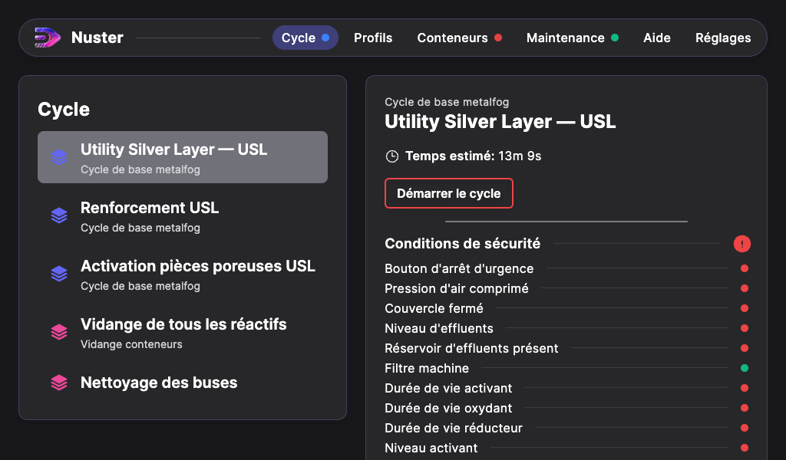
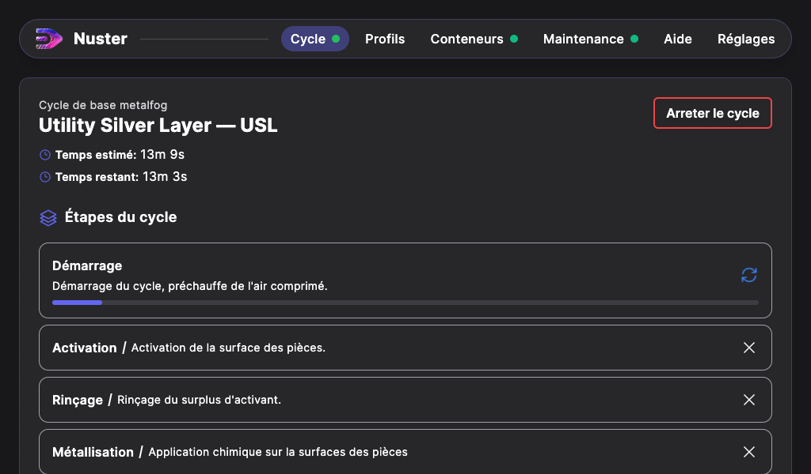
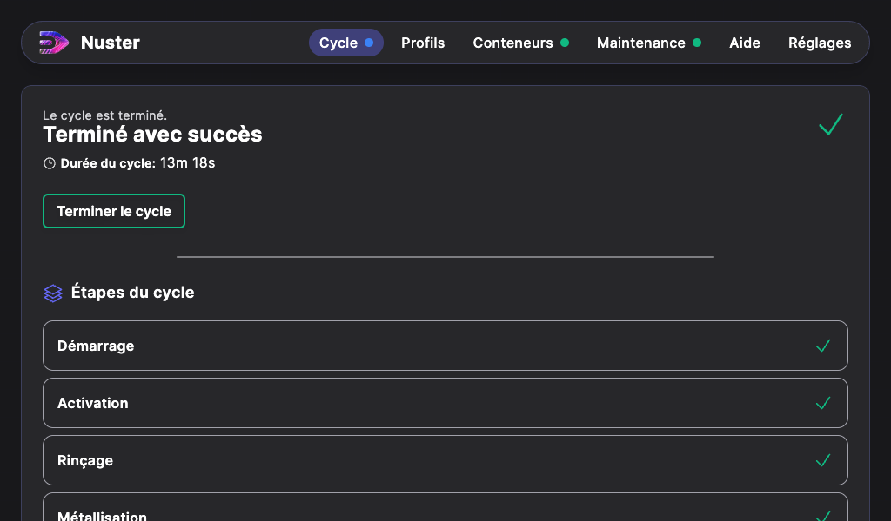

## Cycle de métallisation chimique "Simple"

Pour lancer le cycle de métallisation chimique « Simple », procédez ainsi :

 - Depuis l’écran d’accueil de l’interface digitale, appuyez sur « Cycle »,

 -  Puis appuyez sur "Utility Silver Layer - USL".

 -  Les conditions de sécurité pour lancer le cycle apparaissent. Chaque indicateur doit être vert pour pouvoir démarrer le cycle. Les conditions de sécurité sont détaillées au chapitre « Vérification des conditions de sécurité ».

 - Une fois les conditions de sécurité validées (indicateurs en vert), le cycle peut alors être lancé en cliquant sur le bouton « Démarrer le cycle » jusqu'alors rouge.

 - Au terme du cycle, une nouvelle page s'affiche spécifiant que le cycle est terminé. La mention "Cycle terminé avec succès" indique que la métallisation chimique s'est déroulée correctement.

 - Appuyer sur « Terminer le cycle » pour revenir à la page d’accueil.

 >**Attention** : Si cette page affiche tout autre message que « Cycle terminé avec succès », alors le message qui apparait précise la raison d'arrêt du cycle (pression d'air trop basse, couvercle ouvert, niveau d'oxydant minimal...). En dessous, vous pouvez visualiser les étapes effectuées ou non. 

>Si un cycle Utility Silver Layer - USL s'arrête pendant la métallisation, **ne relancez pas le même cycle** : l'activant viendrait polluer la surface des pièces traitées. Il faut alors lancer un cycle "Renforcement USL" pour terminer la métallisation.

