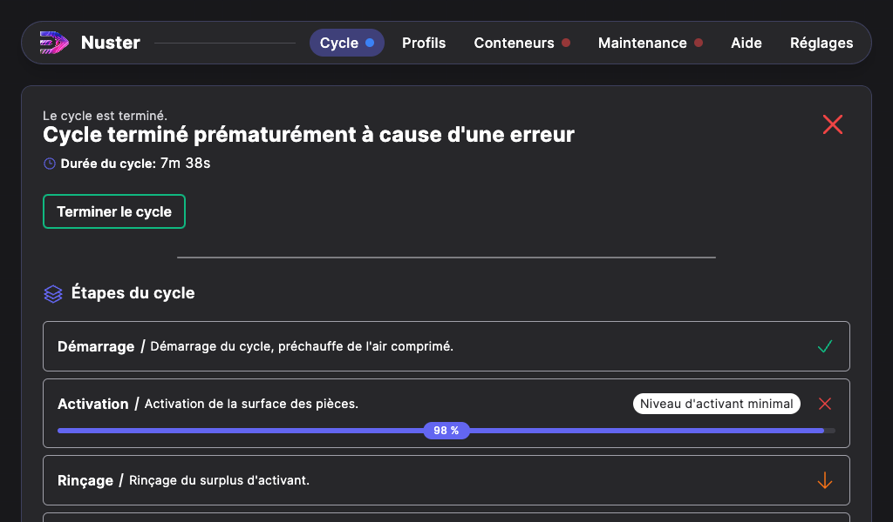

## Cycle de métallisation « Utility Silver Layer - USL »

### Cycle « Utility Silver Layer - USL »

Pour lancer le cycle de métallisation « Utility Silver Layer - USL », procédez ainsi :

Depuis l’écran d’accueil de l’interface digitale, appuyez sur « Cycle », puis appuyez sur « Utility Silver Layer - USL ».
Les conditions de sécurité pour lancer le cycle apparaissent. Chaque indicateur doit être vert pour pouvoir démarrer le cycle (voir chapitre « Vérification des conditions de sécurité »).

Une fois les conditions de sécurité validées (indicateurs en vert), le cycle peut alors être lancé en cliquant sur le bouton « Démarrer le cycle » jusqu'alors rouge.

Au terme du cycle, une nouvelle page s'affiche spécifiant que le cycle est terminé. La mention "Cycle terminé avec succès" indique que la métallisation s'est déroulée correctement.
Appuyez sur « Terminer le cycle » pour revenir à la page d’accueil.

 > **Attention** : Si cette page affiche tout autre message que « Cycle terminé avec succès », alors le message qui apparait précise la raison d'arrêt du cycle (pression d'air trop basse, couvercle ouvert, niveau d'oxydant minimal...). En dessous, vous pouvez visualiser les étapes effectuées ou non.

### Arrêt en cours de cycle

Depuis `Nuster 1.11.9`. Si une étape est arrétée prématurément, sa progression ainsi que sa raison d'arrêt est précisée.

Les 4 étapes suivantes sont susceptibles de s'arrêter prématurément en raison de leur niveau de produit:

- Activation
- Rinçage 1
- Métallisation
- Rinçage 2

#### En cas d'arrêt durant l'Activation

Si le cycle s'arrête durant l'activation, la machine va procéder au rinçage des pièces et au nettoyage des buses. En fonction de la progression de l'activation vous devez procéder de la sorte:

- Si l'activation a dépassé 50%, Relancez un cycle `USL — Utility Silver Layer`.
- Si l'activation a dépassé 90%, Démarrer le cycle `Renforcement USL`.

#### En cas d'arrêt durant le Rinçage 1

Si le cycle s'arrête durant le Rinçage 1, remplissez le conteneur d'eau déionisée. Puis lancez un cycle `Renforcement USL`.

#### En cas d'arrêt durant la Métallisation

Si le cycle s'arrête durant la métallisation, procédez en fonction:

- Si la métallisation a dépassé 95%: aucune opération n'est à effectuer.
- Si la métallisation n'a pas dépassé 95% et que le traitement n'est pas correct, lancez un cycle `Renforcement USL`.

>En effet, si un cycle « Utility Silver Layer - USL » s'arrête pendant la métallisation, **il ne faut pas relancer le même cycle** : l'activant viendrait polluer la surface des pièces traitées. Il faut alors lancer un cycle « Renforcement USL »  pour terminer la métallisation.

#### En cas d'arrêt durant le Rinçage 2

Si le cycle s'arrête durant le rinçage 2, rincez les pièces manuellement.
