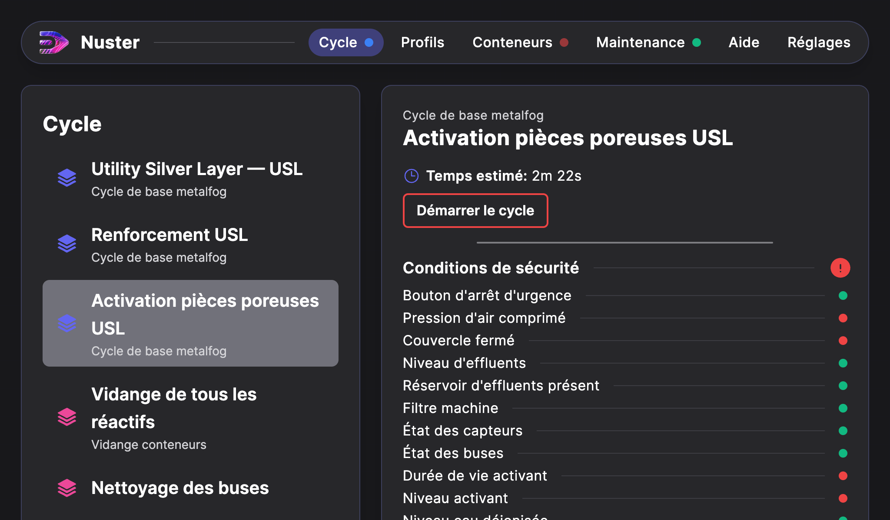
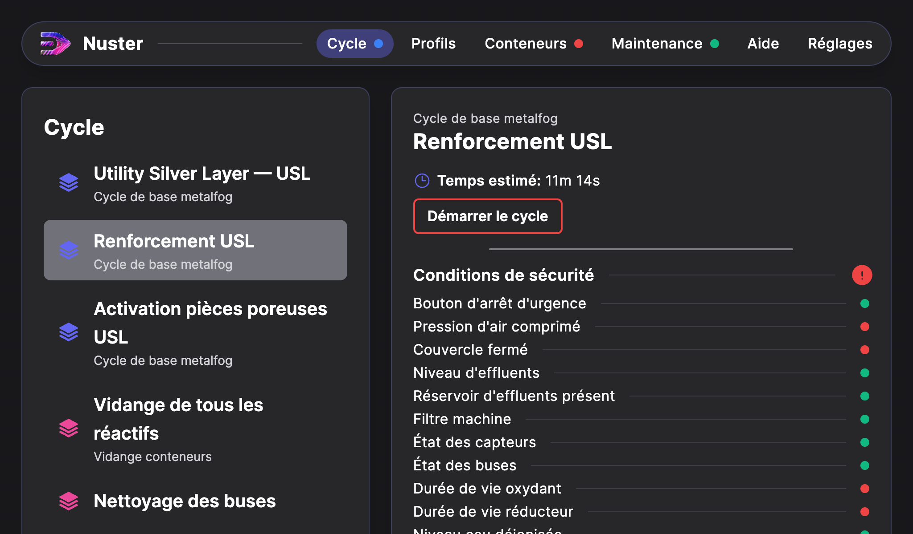
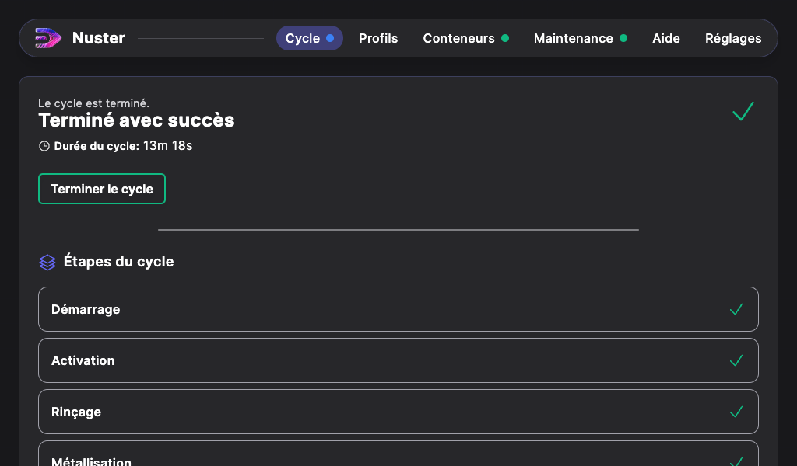

## Cycle de métallisation chimique "Complexe"

La métallisation chimique "Complexe" comprend un cycle "Activation pièces poreuses USL" et un cycle "Renforcement USL".

Pour lancer le cycle de métallisation chimique « Complexe », procédez ainsi :

### Cycle "Activation pièces poreuses USL"

- Depuis l’écran d’accueil de l’interface digitale, appuyez sur « Cycle » ;
- Puis appuyez sur « Activation pièces poreuses USL ».

- Les conditions de sécurité pour lancer le cycle apparaissent. Chaque indicateur doit être vert pour pouvoir démarrer le cycle. Les conditions de sécurité sont détaillées au chapitre « Vérification des conditions de sécurité ».
- Une fois les conditions de sécurité validées (indicateurs en vert), le cycle peut alors être lancé en cliquant sur le bouton « Démarrer le cycle » jusqu'alors rouge.
- Au terme du cycle, une nouvelle page s'affiche spécifiant que le cycle est terminé. La mention "Cycle terminé avec succès" indique que la métallisation chimique s'est déroulée correctement.
- Appuyer sur « Terminer le cycle » pour revenir à la page d’accueil.

> **Attention** : Si cette page affiche tout autre message que « Cycle terminé avec succès », alors le message qui apparait précise la raison d'arrêt du cycle. En dessous, vous pouvez visualiser les étapes effectuées ou non.

> Si le cycle n'a pas abouti, sortez les pièces traitées de la machine et rincez-les à l'eau désionisée. Replacez-les dans la cuve et relancez un cycle « Activation pièces poreuses USL ».

### Rinçage

- Une fois le cycle « Activation pièces poreuses USL » terminé, sortez les pièces de la Metalfog et rincez-les à l’eau désionisée si possible dans un bac à ultrasons pendant 2 minutes.
- Replacez ensuite les pièces dans la Metalfog.

### Cycle "Renforcement USL"

- Depuis l’écran d’accueil de l’interface digitale, appuyez sur « Cycle » ;
- Puis sur "Renforcement USL".

- Comme pour chaque programme, les conditions de sécurité pour lancer le cycle apparaissent. Chaque indicateur doit être vert pour pouvoir démarrer le cycle. Les conditions de sécurité sont détaillées au chapitre « Vérification des conditions de sécurité ».
- Une fois les conditions de sécurité validées (indicateurs en vert), le cycle peut alors être lancé en cliquant sur le bouton « Démarrer le cycle » jusqu'alors rouge.
- Au terme du cycle, une nouvelle page s'affiche spécifiant que le cycle est terminé. La mention "Cycle terminé avec succès" indique que la métallisation chimique s'est déroulée correctement.
- Appuyer sur « Terminer le cycle » pour revenir à la page d’accueil.

 >**Attention** : Si cette page affiche tout autre message que « Cycle terminé avec succès », alors le message qui apparait précise la raison d'arrêt du cycle. En dessous, vous pouvez visualiser les étapes effectuées ou non.

> Si un cycle Renforcement USL s'arrête pendant la métallisation, relancez le même cycle ("Renforcement USL") pour terminer la métallisation.