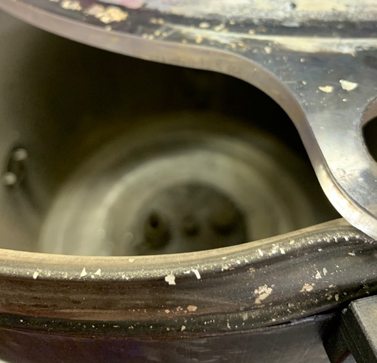
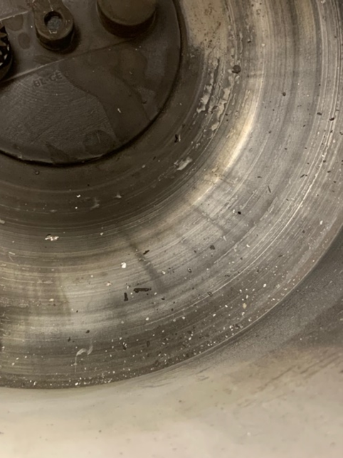
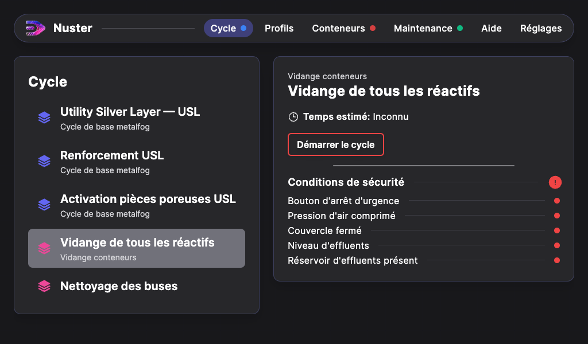

## Entretien de la Metalfog

Afin de garantir le bon fonctionnement et une durée de vie optimale à la Metalfog, il est important d’effectuer des nettoyages réguliers de la machine, en respectant les consignes à suivre.

### Couvercle

Lorsque le couvercle est trop chargé en argenture, une pellicule blanchâtre se forme à la surface.

Lors des cycles, cette pellicule peut alors polluer les pièces à l’intérieur de la cuve et nuire à la qualité de la métallisation chimique (cf. photo ci-dessous).

Nous vous conseillons de nettoyer le couvercle dès l’apparition des premières traces en utilisant du produit nettoyant pour vitres ou de l’alcool isopropylique.

Frottez la surface avec une brosse à poils plastiques souples afin de ne pas rayer le couvercle.

### Cuve

Nous conseillons de nettoyer la cuve une fois par mois, ou plus si utilisation intense, dans le but d’enlever les pellicules d’argent présentes au fond de la cuve. Celles-ci pourraient boucher la grille d’aspiration (cf. photos ci-dessous).

Nettoyez la grille et le fond de cuve en aspirant les pellicules à l'aspirateur avec un embout brosse souple. Pour détacher les parties les plus résistantes, utilisez une brosse à poils plastiques souples et aspirez à nouveau.

### Conteneurs réactifs

Afin de garantir la qualité de la métallisation chimique, nous préconisons le nettoyage des conteneurs des réactifs (Activant, Oxydant et Réducteur) tous les 50 cycles, plus si utilisation intense.

Pour effectuer ce nettoyage, lancez une première vidange. Une fois les 3 conteneurs de réactifs vidés, remplissez-les à nouveau avec 500 mL d’eau déionisée chacun et lancer le cycle en appuyant sur « Vidange de tous les réactifs ».

Une fois lancé, laissez le cycle se terminer avant de revenir à la page d’accueil.

>**Attention** : Les effluents générés lors de l’utilisation de la Metalfog doivent être récoltés et traités dans la filière appropriée. Le code européen déterminé par la directive (UE) 2008/98/CE pour ce type de déchets est le : 09 01 06*, il correspond à « déchets contenant de l'argent provenant du traitement in situ des déchets photographiques- Effluents liquides alcalin pH 10 ».
