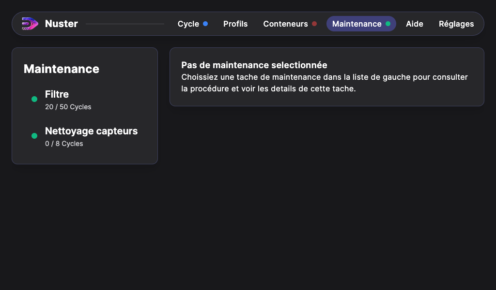

## Maintenance

Dans l'onglet "Maintenance", vous pouvez visualiser le nombre de cycles effectués depuis la dernière maintenance.

Lorsque vous appuyez sur l'un des éléments de la liste, la procédure de maintenance associée s'affiche.
Suivez les étapes décrites.
En bas de la procédure, appuyez sur "Valider la tâche de maintenance" pour remettre à zéro les compteurs de cycles.
