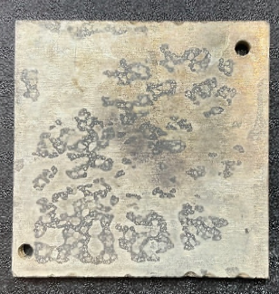
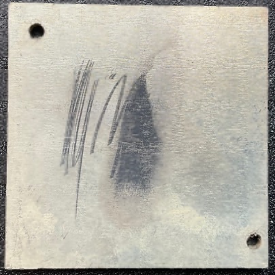
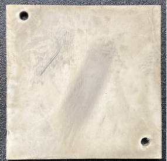

Les pièces à traiter avec la machine Metalfog doivent, au préalable, passer par des étapes de préparation afin d’optimiser la qualité de la métallisation chimique.

Tout au long des étapes de préparation et durant le procédé de métallisation chimique, veiller à manipuler les pièces avec **des gants en coton** afin d’éviter toute pollution de surface.

L’état de surface initial impacte la qualité du dépôt du primaire conducteur et la successive métallisation. Une surface polluée pourrait limiter l’adhésion du dépôt et risquerait de la compromettre.

#### Préparation

1. Dépoussierer les a l'aide de l'air comprimé
2. Nettoyer les pièces dans un bac a ultrason avec un dégraissant
3. Rincer les pièces avec de l'eau désionisée, de préférence dans un bac a ultrasons
4. Placer les pièces sur le montage approprié en veillant a respecter un écartement minimum de 10mm entre chaque pièce.

#### Sablage

Vous pouvez avant toute préparation effectuer un sablage. Cette étape n’est pas obligatoire, elle est cependant vivement conseillée pour des pièces très lisses.

|  |  |
| ---- | ---- |
| Pièce non sablée | Pièce sablée |

