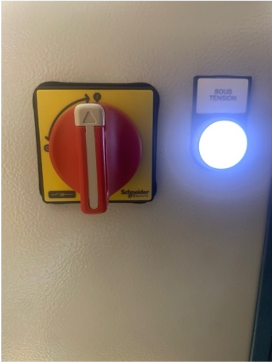

## Mise en route de la Metalfog

La Metalfog doit être installée dans un local équipé d’une Ventilation Mécanique Contrôlée (VMC) ou dans un local pouvant être aéré.

Une fois la Metalfog positionnée à son emplacement, bloquez les deux roulettes frein situées à l’avant de la machine.

#### Electricité

- Vérifiez que le câble et la fiche d’alimentation électrique sont en bon état.
- Reliez la machine au réseau 220V / 10A à l'aide câble d'alimentation.

#### Air comprimé

- Reliez la machine à un réseau d'air comprimé ou à un compresseur grâce au raccord ISO 6150 Type B situé sur la gauche de la machine.
- La pression doit être au minimum égale à 6 bars (0.6 MPa).
- Vérifier que la vanne d’air comprimée est ouverte.

Vanne d'air comprimé ouverte

#### Mise en route

Vérifiez que le bouton d'arrêt d'urgence soit désenclenché.
Pour démarrer la machine, positionnez le sectionneur situé à l'arrière de la machine sur `I`, Le voyant `Sous tension` s'allume. 

test test

