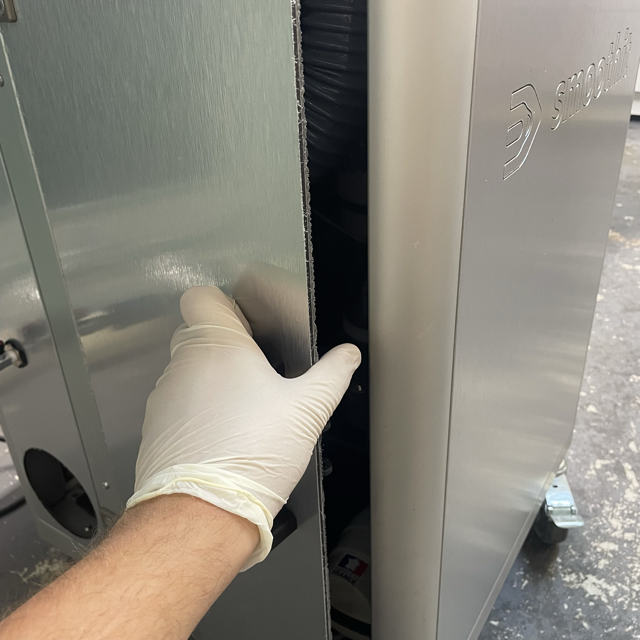
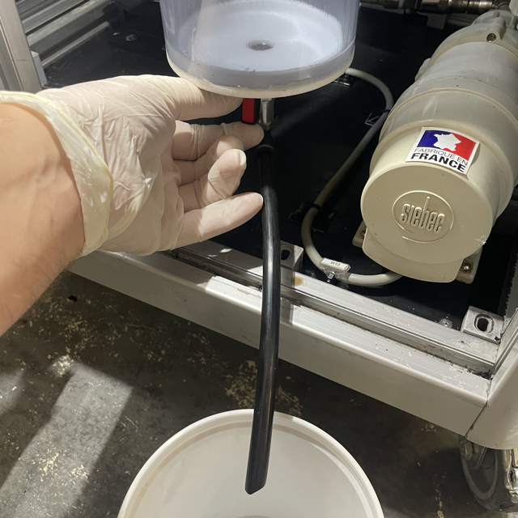
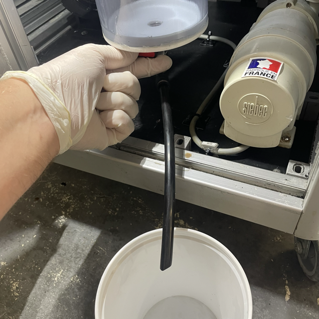

To empty the used varnish container, Open the left door.

The container is equipped with a drain valve, located under the container. Get a bucket to collect the used varnish, then open the drain valve.

Close the valve when the container is empty.

