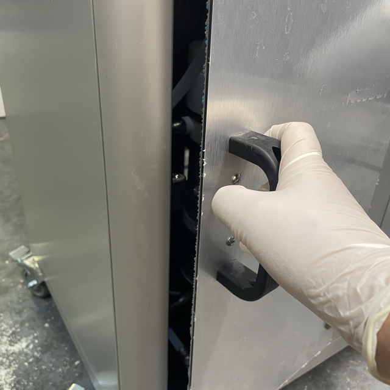
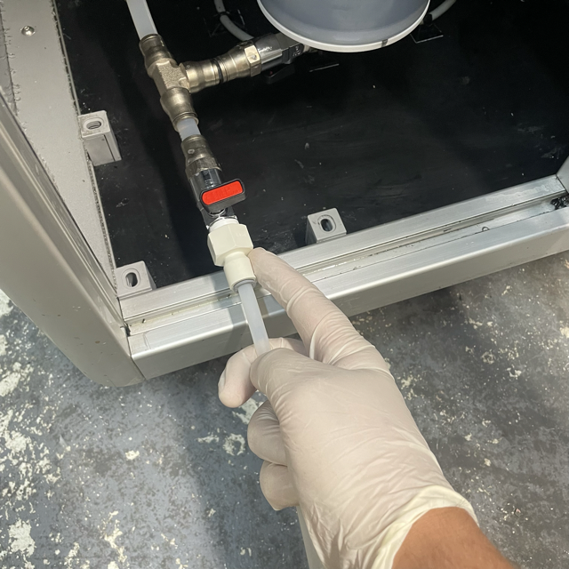
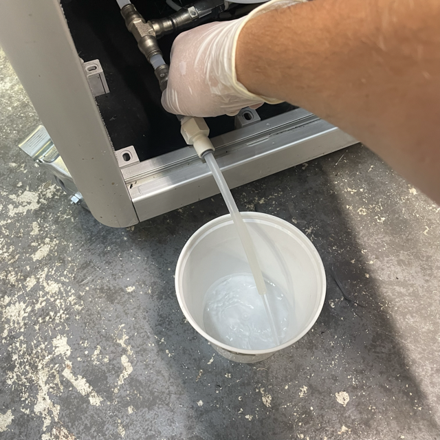
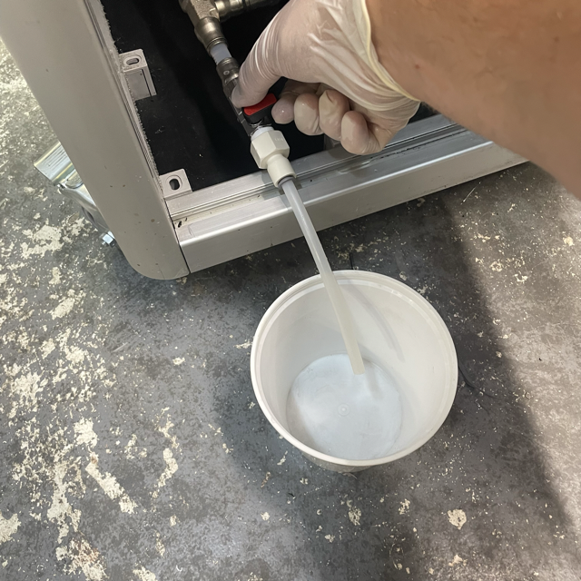
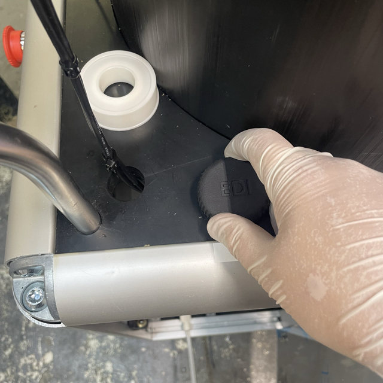
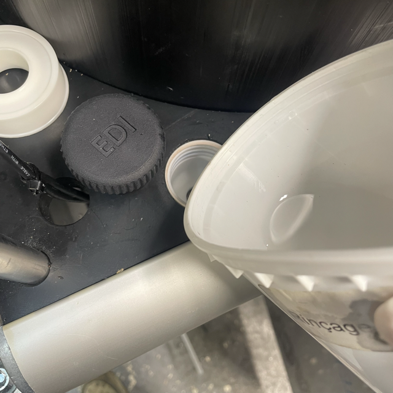
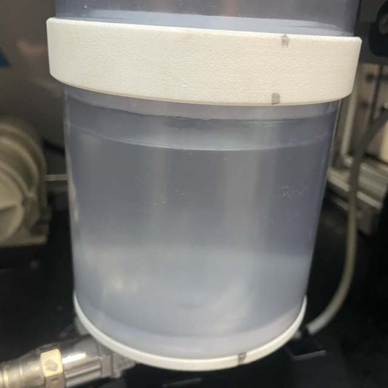

To empty the used water mixed with varnish in the container, Open the right door.

The circulation circuit is equipped with a drain valve, located next to the pump. Place the drain tube into the push to connect white fitting.

Get a bucket to collect the used water mixed with varnish, then open the drain valve.

Close the valve when the container is empty.

When to container is empty, fill back the container using clean water. Open the water inlet, it is located behind the main display.

Fill the water tank using deionised water.

Be careful to not reach the limit.

Close the inlet.
