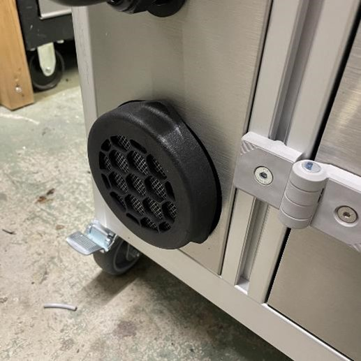
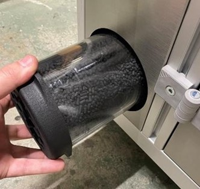

### Filter cartridge swap

> **Warning** : It is recommanded to swap the filter by 75 cycles or when you smell a solvant odor.

The Smoothit filter is location on left side of the machine.

Unscrew the filter by applying a counter-clockwise rotation. When the filter is unlocked, get it out.

When the filter is out, replace the filter.
