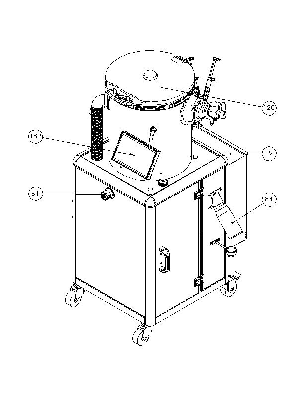
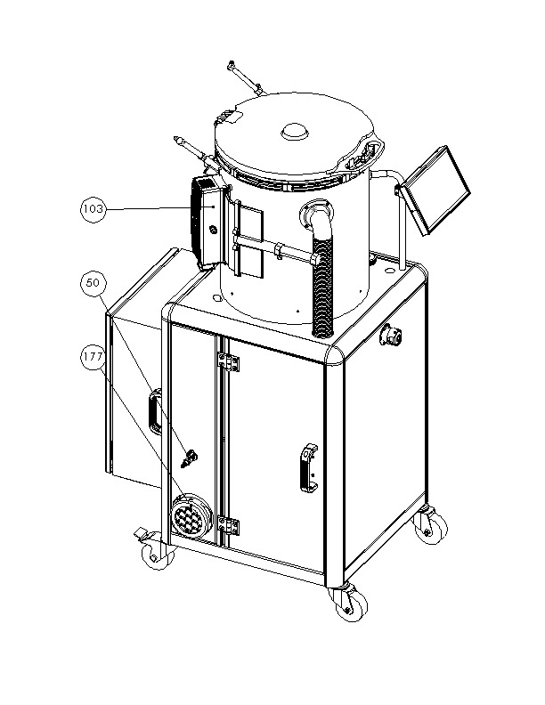
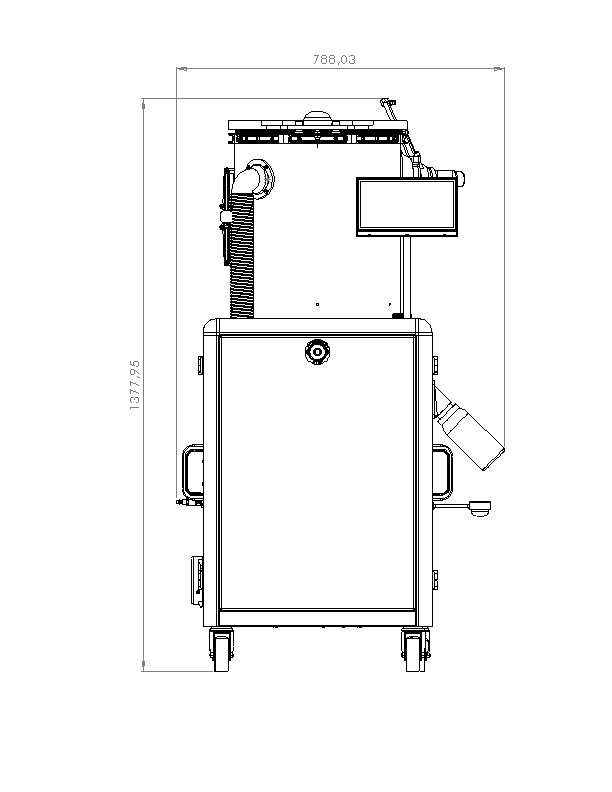
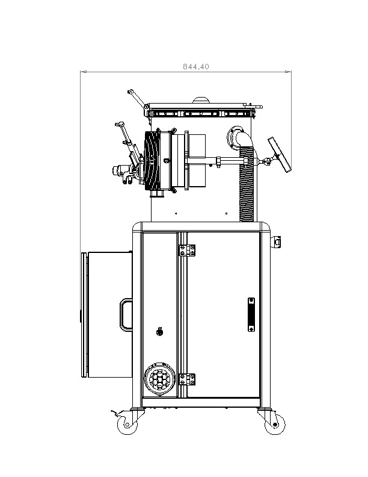
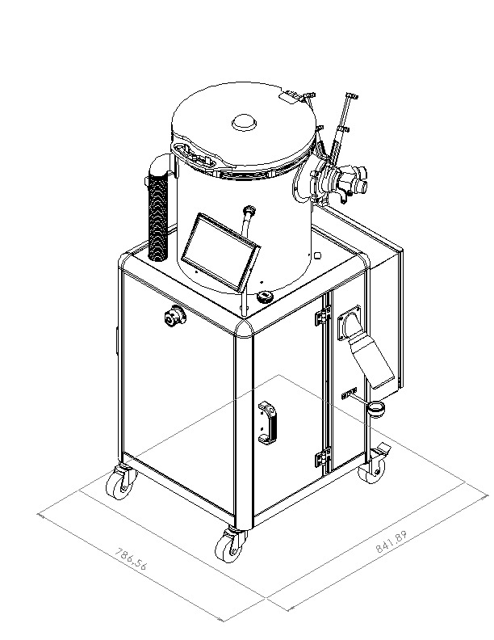

## Machine elements description

### Elements

| Number | Description |
| ----- | ----- |
| 29 | Electric cabinet |
| 61 | Emergency stop button |
| 84 | Varnish bottle |
| 128 | Lid |
| 189 | Tactile screen |

\newpage

| Number | Description |
| ----- | ----- |
| 50 | Compressed nitrogen valve |
| 103 | UV Lamp |
| 177 | Filter |

### Technical caracteristics

- Mass : 80 kg when empty
- Dimensions : 790 mm x 850 mm x 1390 mm
- Maximum consumed power : 1 kW
- Maximum nitrogen flowrate : 600 L / min

\newpage

### Dimensions

#### Front view

#### Side view

#### Isometric view

