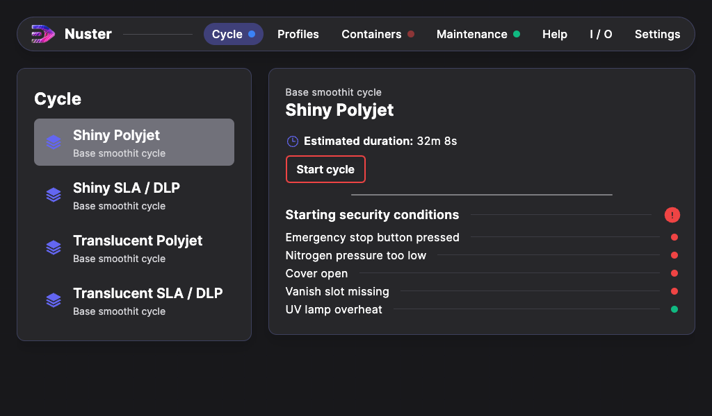

## Smoothit start-up

The Smoothit must be installed in a room equipped with controlled mechanical ventilation (CMV), or in a room that can be ventilated.
Once the Smoothit is in position, lock the two brake wheels at the front of the machine.

### Energies

#### Electricity

- Check that the power cable and plug are in good condition.
- Connect the machine to the 230V / 16A power supply using the power cable.

#### Pressurized Nitrogen

- Connect the machine to a pressurized nitrogen network or compressor using the ISO 6150 Type B connector on the left-hand side of the machine.
- Pressure must be at least 6 bar (0.6 MPa).
- Check that the pressurized nitrogen valve is open.

### Start-up

To start the machine, turn the switch on the rear of the machine to `I`, and the `Under voltage` indicator will light up.

### Software interface

The Smoothit is controlled by Nuster software.
Once the machine is up and running, you can access its functions via the touch screen.

