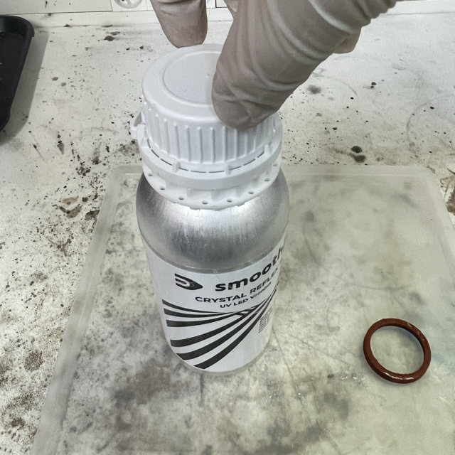
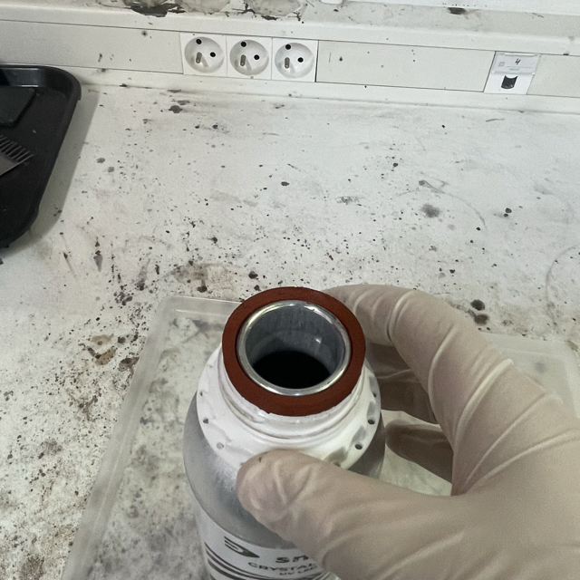
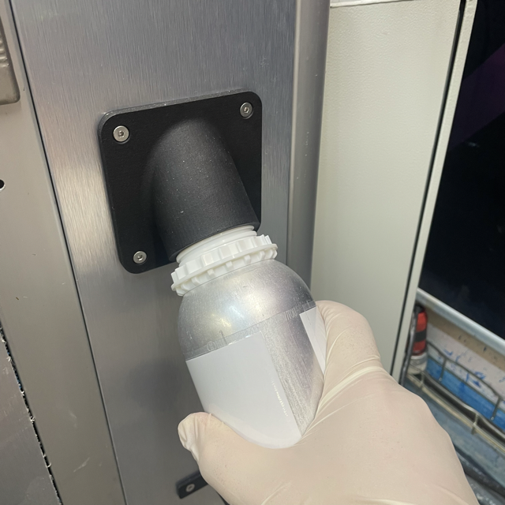
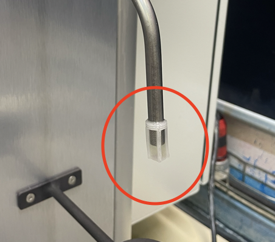
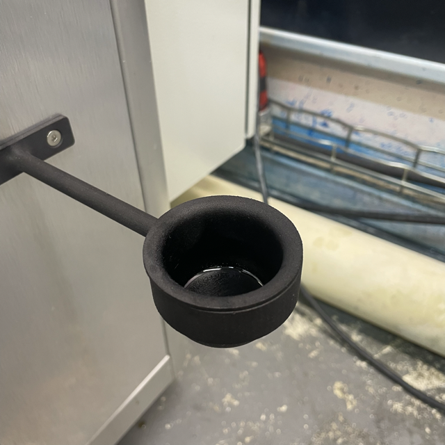

## Installing varnishes

### Prequisites

Before handling varnishes, make sure you wear the appropriate PPE:

- nitrile gloves,
- goggles,
- FFP3 face mask.

> **Warning:** Avoid skin contact with the varnish.

All these procedure should be done when the machine is not running a cycle. A security condition will check for the bottle presence and thus will stop the cycle if it's missing.

### Installing a varnish

To install a varnish, get the varnish you want to use:

- Shiny varnish (`SV-01`)
- Crystal varnish (`CV-01`)

Unscrew the bottle cap.

Place the silicon joint to prevent presurized nitrogen and varnish leaks.

Screw the bottle inside its handler.
> **Warning:** Take care to not overtorque the bottle inside its handler.

### Uninstalling a varnish

To uninstall a varnish, simply unscrew the bottle from its handler.
Take the silicon joint appart and clean it with a paper towel with some Isopropylic alcohol (IPA).

If the type of varnish that will be installed next is different from the varnish you had now, change the tip filter.

> **Warning:** Change the filter if its more than one week old.

Check if the varnish handler waster receiver is not full, is so empty it.

