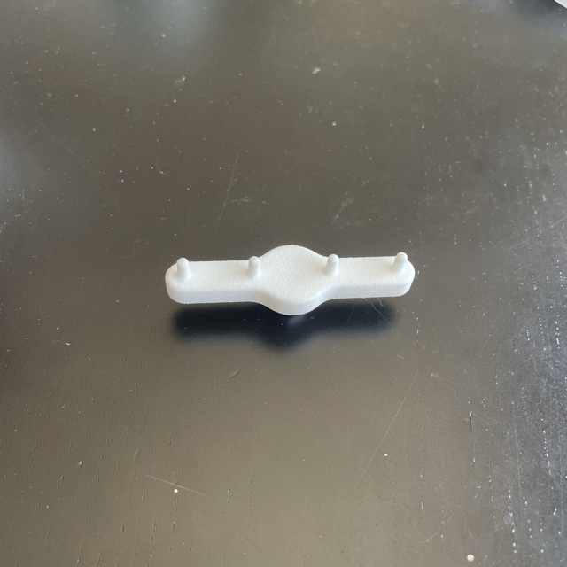
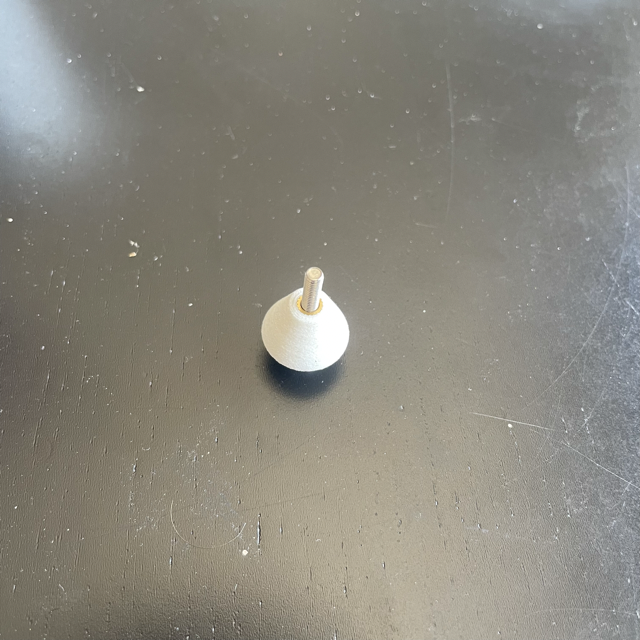
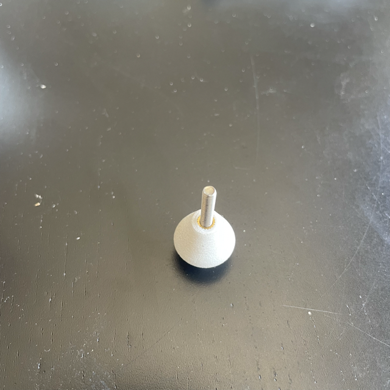
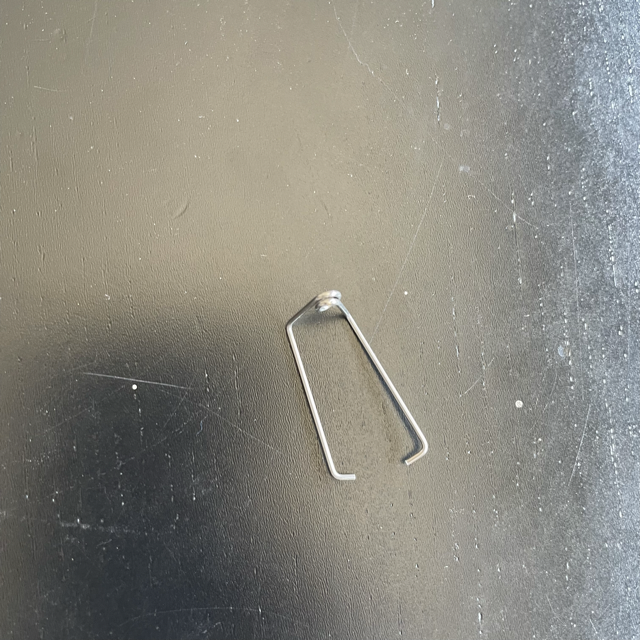
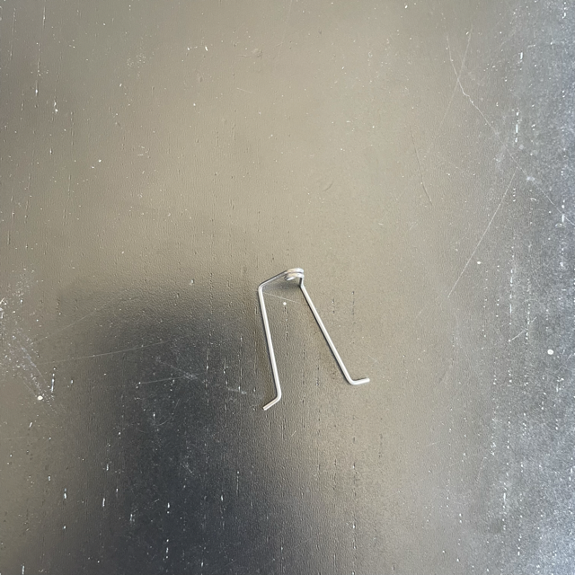
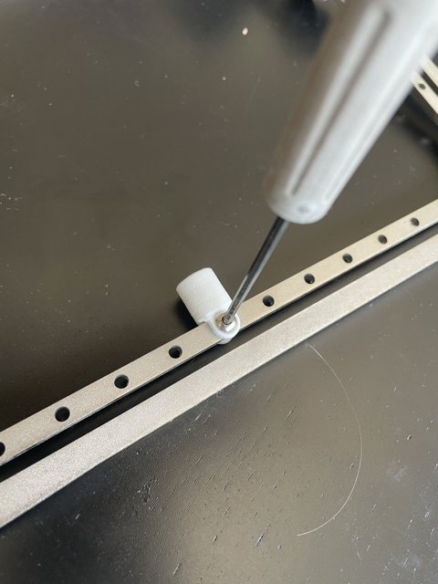
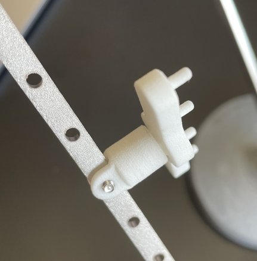

## Parts preparation

Parts post-processed with the Smoothit machine must first go under a set of preparation steps to ensure a successful coating. Throughout the preparation stages and during the process, make sure you handle the parts with **gloves** to avoid surface contamination.

The initial surface condition affects the quality of the varnish deposit. A polluted, undegreased or unpolymerized surface will lead to varnish defects (poor adherence, nodules, etc.).

Follow these key steps to improve the result givent by your Smoothit.

### Sandblasting

Follow the table to get the sandblasting parameters for the material you wish deposit on

| Material | Sanding pressure | Sandblasting media |
| ------ | ------ | ----- |
| Polyjet | 0.6 MPa | Corindon 180 |
| SLA / DLP | 0.25 MPa | Corindon 180 |

> After sandblasting, make sure to remove all the remaining sand off the part by blowing pressurized air on the part.

### Washing & Rinsing

We recommand to wash your part using degreasant with an ultrasonic bath. Degrasing removes all the hydrophobic molecules.

Then rinse your parts using clean deionized water in a ultrasonic bath. The rinsing step is mandatory to remove any remaining degreaser on the part.

> To have an efficient, adapted on polymer parts, you can use an USCleaner. Get additional informations on [www.metalizz.com](https://www.metalizz.com/solutions-metallisation/uscleaner/)

### Checking

Make sure the parts do not have remaining dust after the Washing / Rinsing step.

### Drying

You need to dry your parts using a drying oven, parts with remaining water will not get post-processed correctly.

### Surface activation *(Optional)*

If the surface adhesion must meet some requirements, you can use:

- Flame treatment
- Plasma
- Corona

These surface activations techniques might require additional care about your parts.

## Placing parts in the support

To be post-processed with your Smoothit machine, your parts must be attached to the Smoothit HPAD part handling system.

Each part must be not too close from each-other, we recommend a 15-20mm space between parts.

Use the provided supports to attach parts into the support.

|  |  |  |
| :----: | :----: | :----: |
| Grippers Rake | Grippers Screw M3 x 10 | Grippers Screw M4 x 16 |

For the **Grippers Rake**, you can add springs to maintain your parts using springs. Push the springs on top of the pins to attach them on the Rake gripper.

| |  |
| :---: | :---: |
| Inward spring | Outward spring |

Each gripper can be attached to the inner frame using `HPAx-Fix` small parts. They can be attached to the frame using an M3 Screw.

You can now place your part using a gripper inside the `HPAx-Fix` part.

Your are now ready to go !
