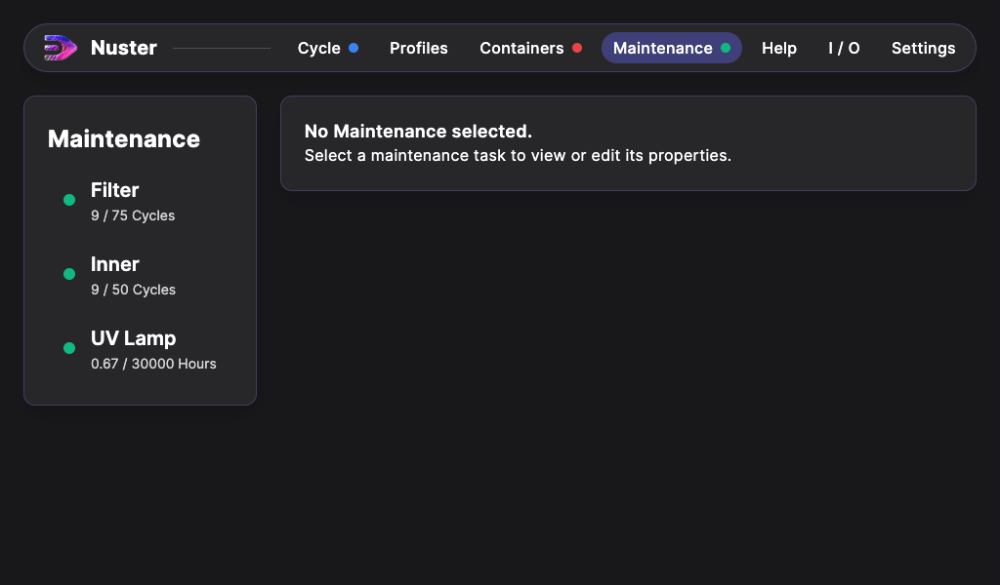

## Maintenance

In the maintenance Tab, you can view the number of cycles dones for each maintenance task.

> Pay attention to the dot after the `Maintenance` button. it indicates the state of the maintenance tasks.

When you click on one of the maintenance task in the list, the maintenance procedure is displayed.

Follow the written steps, at the bottom of the procedure, click on the `Validate` button to reset the cycle counter.
