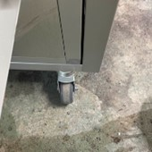
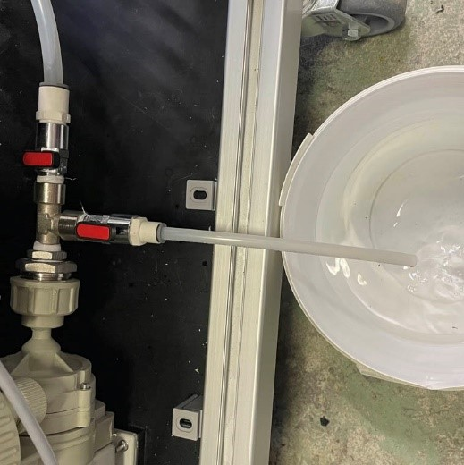
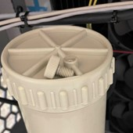
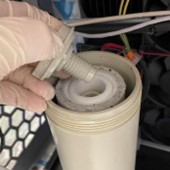
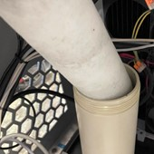
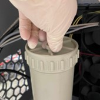

### Changement de la cartouche filtrante

> **Attention :** Il est recommandé de changer la cartouche filtrante tous les 3 mois, même si elle n'est pas colmatée.

Les effluents de l'Uscleaner sont des produits à manipuler avec précaution, veillez à porter les EPI adéquats, en particulier : ***gants en latex, lunettes de protection et à éviter tout contact avec la peau***.

Dans un premier temps, positionnez les roulettes de la partie arrière de la machine vers l'arrière et ouvrez la porte.

\newpage

À l'intérieur, fermez les 2 vannes puis installez le tube de vidange. Une fois ce dernier en place, ouvrez la vanne de vidange.

Ouvrez l'évent de la pompe pour vidanger le corps de filtre jusqu'à ce que plus rien ne s'écoule. 

\newpage

Ensuite, ouvrez le corps de filtre en dévissant l'écrou du haut puis retirez la cartouche filtrante en dévissant son écrou de maintient.

Sortez la cartouche du corps de filtre en l'inclinant.

\newpage

Remplacez la cartouche par une cartouche neuve.

Puis resserrez l'écrou de la cartouche filtrante.

\newpage

Remontez l'écrou du corps de filtre et revissez l'évent sans le serrer jusqu'au bout.

Fermez la vanne de vidange et ouvrez les deux vannes principales.

\newpage

Une fois que vous observez du liquide couler légèrement par l'évent, l'air est purgé : vous pouvez serrez complétement l'évent du filtre.

