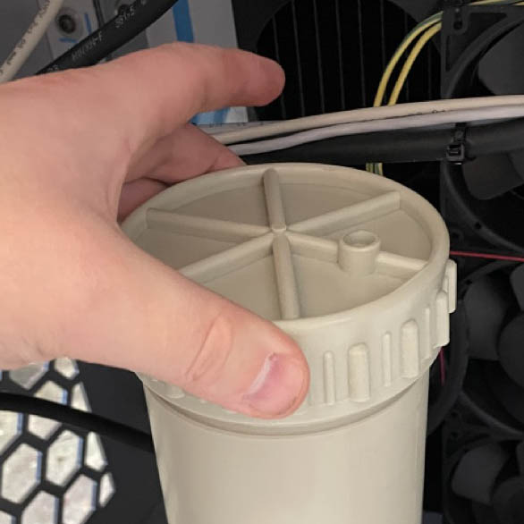

### Changement de la cartouche filtrante

Dans un premier temps, positioner l'USCleaner afin que les roulettes de la partie arrière soient disposée vers l'arrière.

Fermer les 2 vannes, installer le tube de vidange et ouvrir la vanne de vidange.

Ouvrir l'évent de la la pompe pour vidanger le corps de filtre. Vidanger le corps de filtre jusqu'as ce qu'aucun liquide ne coule.

Ouvrir le corps de filtre en dévissant l'écrou du corps de filtre.

> A partir de cet instant il est reccomandé d'utiliser des gants Latex.

Après ouverture du corps de filtre, retirer la cartouche filtrante en dévissant son écrou.

Sortir la cartouche du corps de filtre, attention la sortie de la cartouche peut s'avérer délicate due a la place disponible.

Remplacer la cartouche par une cartouche neuve.

Resserrer l'écrou de la cartouche filtrante.

Remonter l'écrou du corps de filtre, revisser l'évent du corps de filtre sans le serrer jusqu'au bout.

Fermer la vanne de vidange, ouvrir les deux vannes principales.

Refermer l'évent du filtre lorsque du liquide sort par l'évent.

