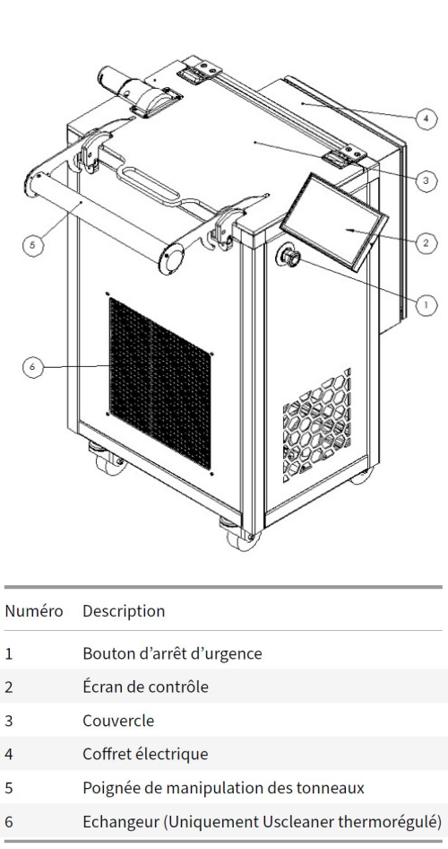
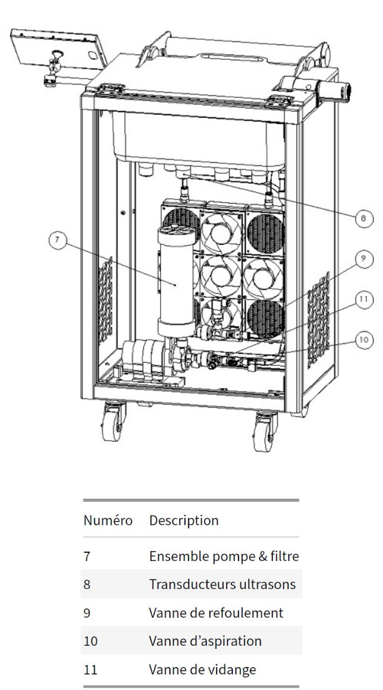

## Description des composants de la machine

\newpage

\newpage

### Caractéristiques techniques

- Masse : 60 kg à vide
- Dimensions : 970 mm x 865 mm x 1100 mm
- Surface au sol : 0.84 m2
- Puissance max : 1.2 kW

### Dimensions

#### Vue de face

#### Vue de côté

#### Vue isométrique

