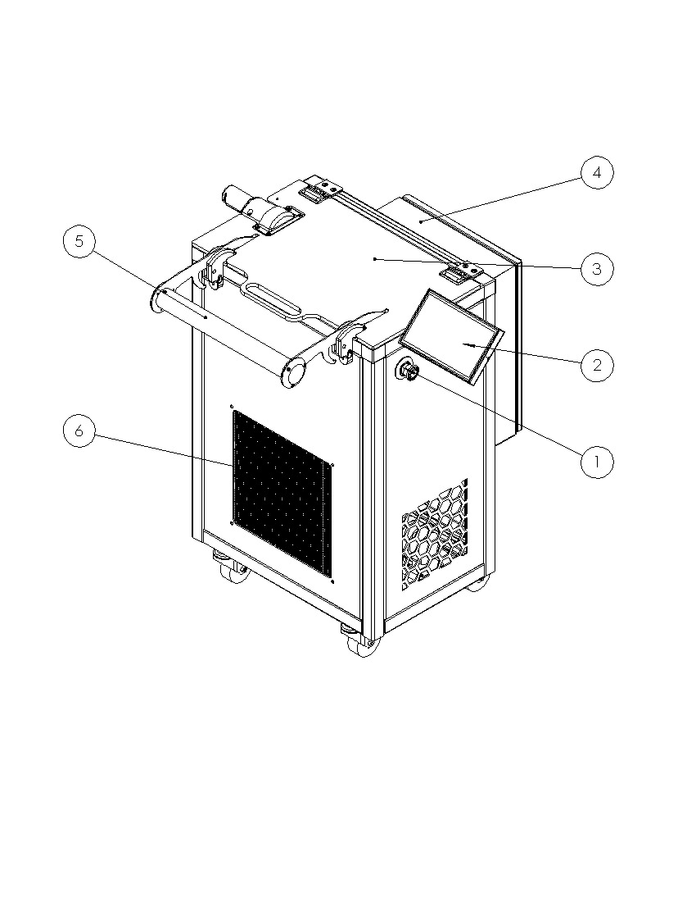
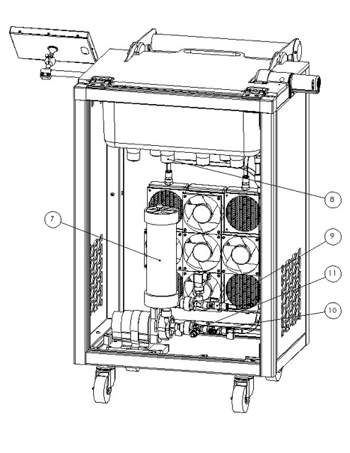
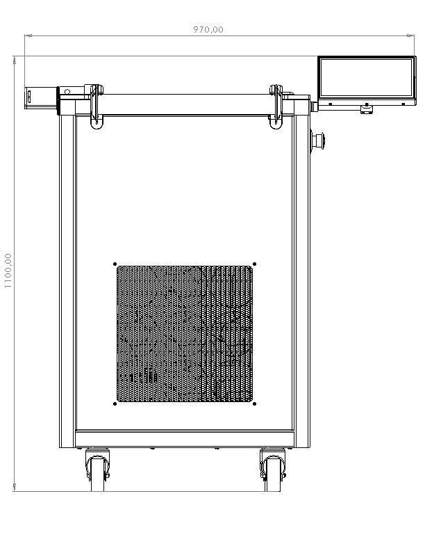
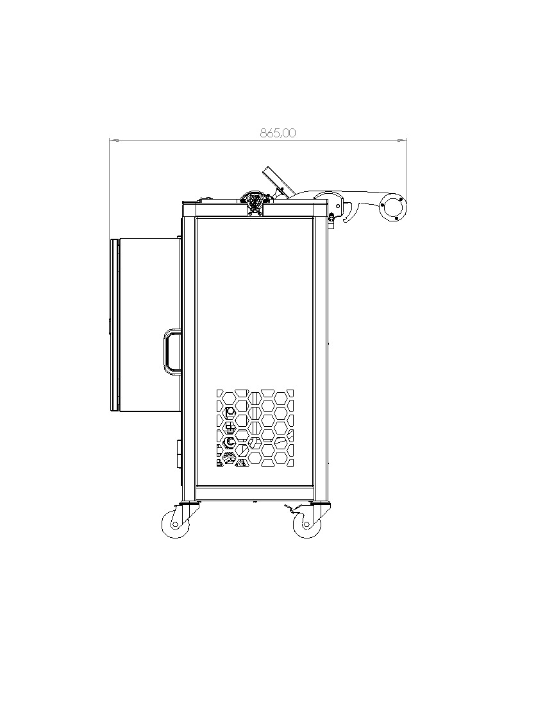
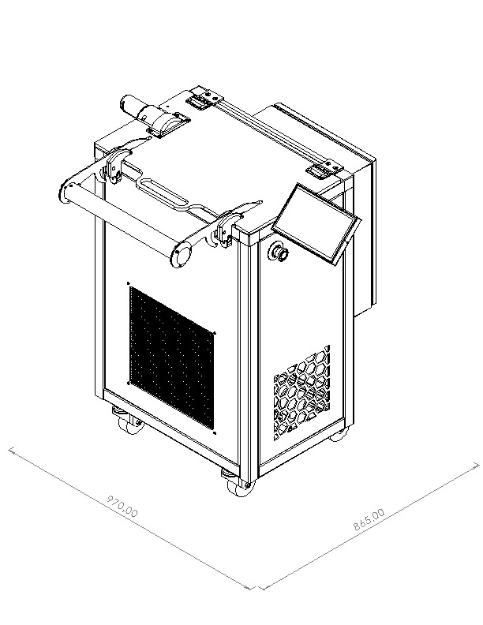

## Description des composants de la machine

\newpage

| Numéro | Description |
| ----- | ----- |
| 1 | Bouton d'arrêt d'urgence |
| 2 | Écran de contrôle |
| 3 | Couvercle |
| 4 | Coffret électrique |
| 5 | Poignée de manipulation des tonneaux |
| 6 | Echangeur (Uniquement USCleaner M R1 TR) |

\newpage

| Numéro | Description |
| ----- | ----- |
| 7 | Ensemble pompe & filtre |
| 8 | Transducteurs Ultrasons |
| 9 | Vanne de refoulement |
| 10 | Vanne d'aspiration |
| 11 | Vanne de vidange |

### Caractéristiques techniques

- Masse: 60 kg à vide
- Dimensions: 970 mm x 865 mm x 1100 mm
- Surface au sol: 0.84 m2
- Puissance max: 1.2 kW

### Dimensions

#### Vue de face

#### Vue de coté

#### Vue isométrique

