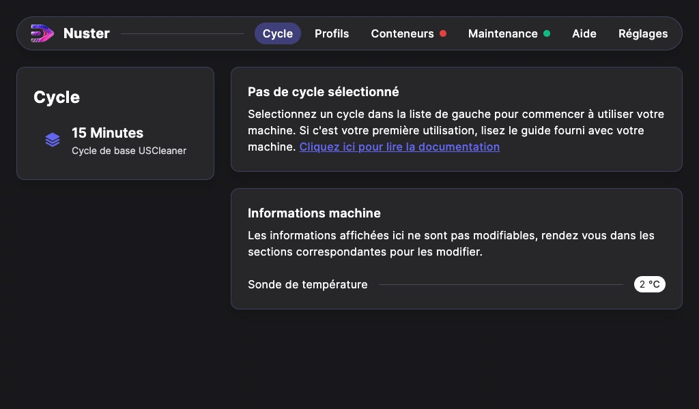

## Mise en route de l'USCleaner

L'USCleaner doit être installé dans un local équipé d’une Ventilation Mécanique Contrôlée (VMC) ou dans un local pouvant être aéré si il est utilisé avec une autre agent chimique de l'eau.

Une fois l'USCleaner positionné à son emplacement, bloquez les deux roulettes frein situées à l’avant de la machine.

### Énergies
#### Électricité

- Vérifiez que le câble et la fiche d’alimentation électrique sont en bon état.
- Reliez la machine au réseau 220V / 10A à l'aide câble d'alimentation.

### Mise en route

Pour démarrer la machine, positionnez le sectionneur situé à l'arrière de la machine sur `I`, Le voyant `Sous tension` s'allume. 

### Interface logiciel

La Metalfog est pilotée grâce au logiciel Nuster. 
Une fois la machine en route, vous pouvez accéder à ses fonctions avec l'écran tactile.

Il est possible de choisir entre 2 modes d'affichage : Clair ou Sombre. Pour cela, appuyez sur l'onglet "Réglages", puis sur le bouton de sélection du mode.

