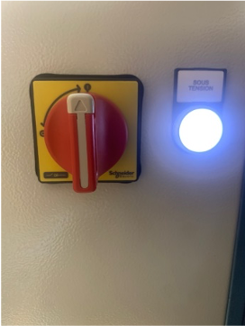
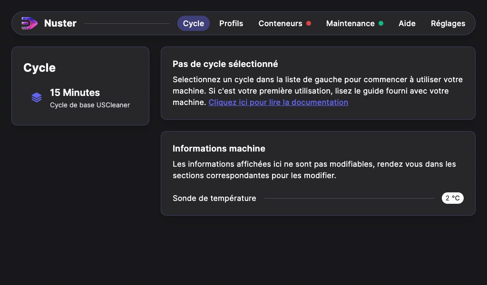
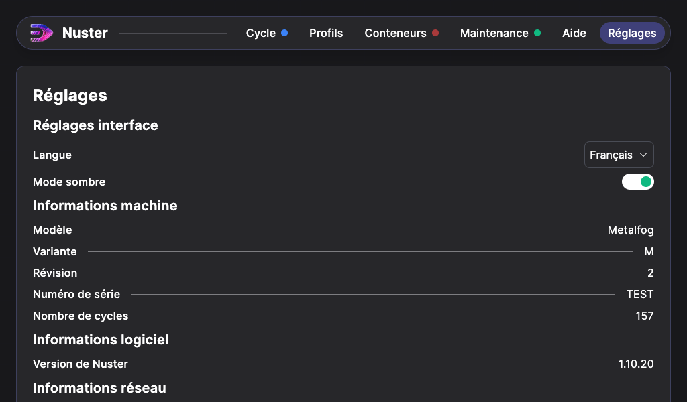

## Mise en route de l'Uscleaner

L'Uscleaner doit être installé dans un local équipé d’une Ventilation Mécanique Contrôlée (VMC) ou dans un local pouvant être aéré s'il est utilisé avec un autre agent chimique que l'eau.

Une fois l'Uscleaner positionné à son emplacement, bloquez les deux roulettes frein situées à l’avant de la machine.

Il est conseillé de placer la machine **sur rétention** pour remplir le bac et pour stocker la machine une fois celui-ci rempli. D'autant plus, si l'Uscleaner est utilisé avec notre nettoyant spécial résine  `Cleaner CR1` : le solvant peut dégrader les sols peints.

### Énergies
#### Électricité

Vérifiez que le câble et la fiche d’alimentation électrique sont en bon état.
Reliez la machine au réseau 220V / 10A à l'aide du câble d'alimentation.

### Mise en route

Pour démarrer la machine, positionnez le sectionneur situé à l'arrière de la machine sur **I**, le voyant **Sous tension** s'allume. 

### Interface logiciel

L'Uscleaner est piloté grâce au logiciel Nuster.
Une fois la machine en route, vous pouvez accéder à ses fonctions via l'écran tactile.

Il est possible de choisir entre 2 modes d'affichage : Clair ou Sombre. Pour cela, appuyez sur l'onglet **Réglages**, puis sur le bouton de sélection du mode.

