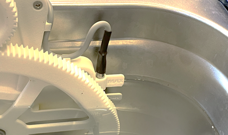

## Remplissage du bac

Avant de manipuler les solutions chimiques, veillez à porter les EPI adéquats, en particulier : ***gants en latex, lunettes de protection et masque de protection FFP3 et à éviter tout contact avec la peau***.

Lors du remplissage du bac, veillez à ce que tout le circuit de la pompe soit vidangé. Utilisez la vanne de vidange située à l'intérieur de la machine avec son tube prolongateur.

Selon la configuration de votre Uscleaner, la quantité de fluide nécessaire diffère.

| Uscleaner | Uscleaner Thermorégulé |
| --------- | ------------ |
| 20 Litres | 22 Litres |

\newpage

Veillez à respecter les limites de remplissage indiquées au niveau du grand engrenage.

### Suivi de la durée de vie des produits

Vous pouvez suivre la durée de vie du produit chargé dans le bac à l'aide du logiciel Nuster. Rendez-vous dans l'onglet **Conteneurs**, sélectionnez **Bac de liquide**, puis cliquez sur **Produits**.

En cliquant sur **Chargement manuel**, le logiciel Nuster vous demande quel type de produit est chargé dans la machine. Choisissez, puis cliquez sur **Chargement manuel**. En fonction du produit chargé, la durée de vie restante s'actualise.

En cliquant sur **Vidange manuelle**, le suivi de la durée de vie du produit est désactivé, et la machine considère qu'aucun produit n'est chargé dans le bac de liquide.

> En cas de vidange du CR-1, le produit usagé doit être traité en filière agréée (code déchet européen 14 06 03* d'après la directive (UE) 2008/98/CE).

\newpage

### Thermorégulation

> **Attention :** La thermorégulation est disponible uniquement sur le modèle Uscleaner thermorégulé.

Il est possible de réguler la température du fluide contenu dans le bac de liquide de votre Uscleaner thermorégulé. Pour ce faire, rendez-vous dans l'onglet **Conteneurs**, appuyez sur **Bac de liquide**, puis sur **Régulation**.

Dans ce menu vous pouvez :

- Gérer l'état de la régulation (activé / désactivé)
- Gérer la consigne de température (maximum = 50°C).
