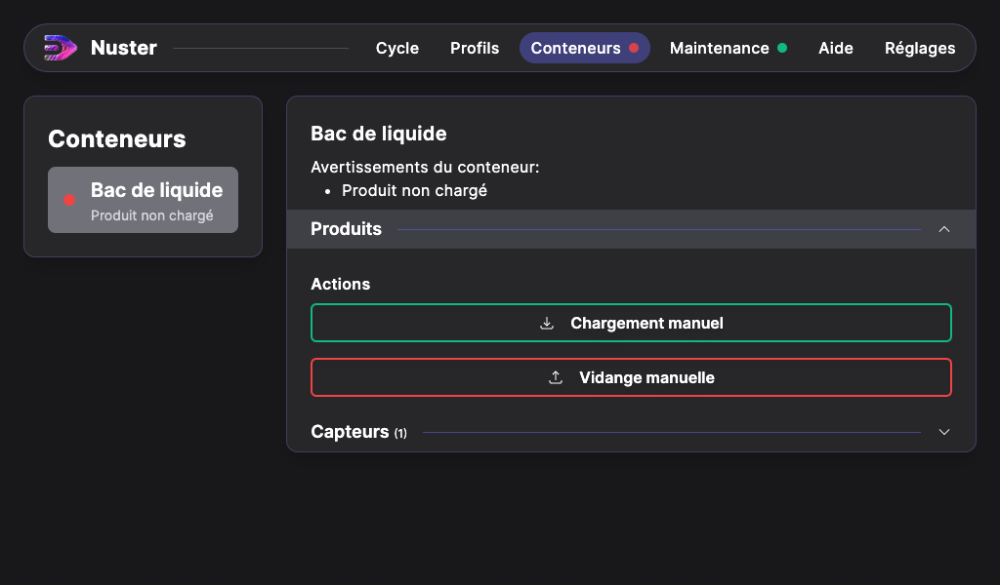
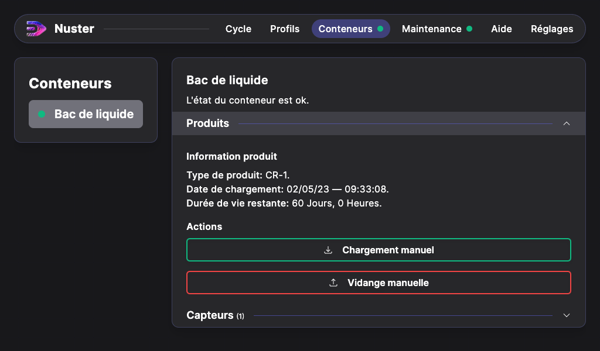
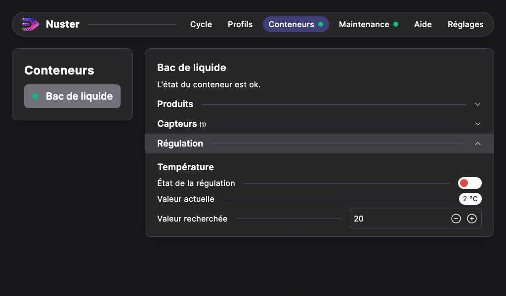

## Remplissage du bac

Avant de manipuler les solutions chimiques, veillez à porter les EPI adéquats, en particulier : ***gants en nitrile, lunettes de protection et masque de protection FFP3 et à éviter tout contact avec la peau***.

Lors d'un remplissage du bac, veillez a ce que tout le circuit de la pompe soit vidangé. Utilisez la vanne de vidange située a l'intérieur de la machine.

Selon la configuration de votre USCleaner, La quantité de fluide nécéssaire diffère.

| USCleaner | USCleaner TR |
| --------- | ------------ |
| 20 Litres | 22 Litres |

Veillez a respecter les limites de remplissages indiquées au niveau du grand engrenage.

### Suivi de la durée de vie des produits

Vous pouvez faire le suivi de la durée de vie du produit chargé dans le bac a l'aide de Nuster. Rendez vous dans la page **Conteneurs**, selectionnez le **Bac de liquide**, puis cliquez sur **Produits**.

En cliquant sur **Chargement manuel**, Nuster vous demande quel type de produit est chargé dans la machine. Choisissez, puis cliquez sur **Chargement manuel**. En fonction du produit chargé, La durée de vie restante s'actualise.

En cliquant sur **Vidange manuelle**,  Nuster retire le suivi du produit, et considère qu'aucun produit est chargé dans le **Bac de liquide**.

> En cas de vidange du CR-1, il est que le traitement du CR-1 usagé soit réalisé en filière agréée (code déchet européen 14 06 03* d'après la directive (UE) 2008/98/CE).

### Thermorégulation

> Avertissement: Disponible uniquement sur les USCleaner TR

Il est possible de réguler la température du fluide contenu dans le **Bac de liquide** de votre USCleaner. Pour ce faire, rendez vous dans **Conteneurs**, Cliquez sur **Bac de liquide**, puis cliquez sur **Régulation**.

Dans ce menu vous pouvez:

- Gérer l'état de la regulation (activé / désactivé)
- Gérer la consigne de température (max 50°C)
