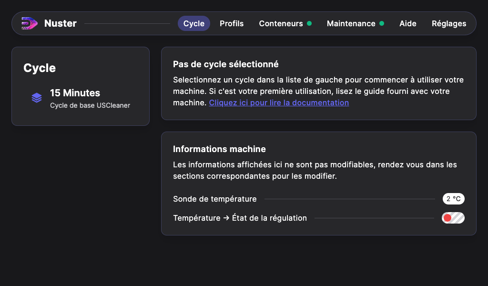

## Lancement d'un cycle de nettoyage
### Préparation du cycle

Pour lancer un cycle de nettoyage, rendez-vous dans l'onglet **Cycles**. Dans la liste de gauche sont disponibles vos profils ainsi que les profils `constructeur`.

Choisissez le cycle que vous souhaitez effectuer dans la liste de gauche.
Les conditions de sécurité s'affichent.
Si une de ces conditions n'est pas valide (voyant rouge ou orange), une action est requise. Consultez le chapitre [Conditions de sécurités](../40-safety/index.md) pour en savoir plus.

Lorsque toutes les conditions de sécurité sont valides, le bouton `Lancer le cycle`  passe au vert et vous pouvez démarrez le cycle.

### Fin du cycle

Au terme d'un cycle, une nouvelle page s'affiche spécifiant que le cycle est terminé. La mention "Cycle terminé avec succès" indique que le nettoyage s'est déroulé correctement.

Appuyer sur « Terminer le cycle » pour revenir à la page d’accueil.

 >**Attention** : Si cette page affiche tout autre message que « Cycle terminé avec succès », alors le message qui apparait précise la raison d'arrêt du cycle (surchauffe, couvercle ouvert...). En dessous, vous pouvez visualiser les étapes effectuées ou non. 

