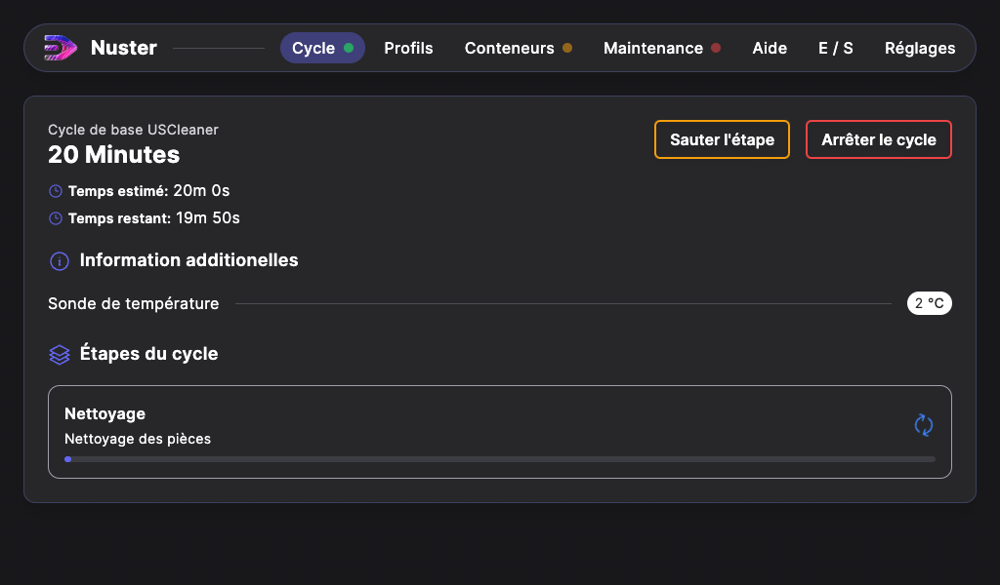

## Lancement d'un cycle de nettoyage
### Préparation du cycle

Pour lancer un cycle de nettoyage, rendez vous sur la page `Cycles`. Dans la liste de gauche sont disponible vos profils ainsi que les profils construteur.

Choisissez le cycle, dans la liste de droite s'affichent les conditions de sécurités.
Si une de ces conditions n'est pas valide (voyant rouge / orange), consultez la page [Conditions de sécurités](../40-safety/index.md) pour rendre cette condition valide.

Lorsque toute les conditions sont valides, Le bouton `Lancer le cycle` passe au vert, vous pouvez donc lancer le cycle.

### Fin du cycle

Lorsque le cycle est terminé, cet écran s'affiche.

Il résume le déroulé du cycle, ainsi que sa raison de fin, Si cette raison est autre que `Terminé avec succès` alors quelque-chose c'est mal déroulé. La raison de fin précise l'élément mis en cause.