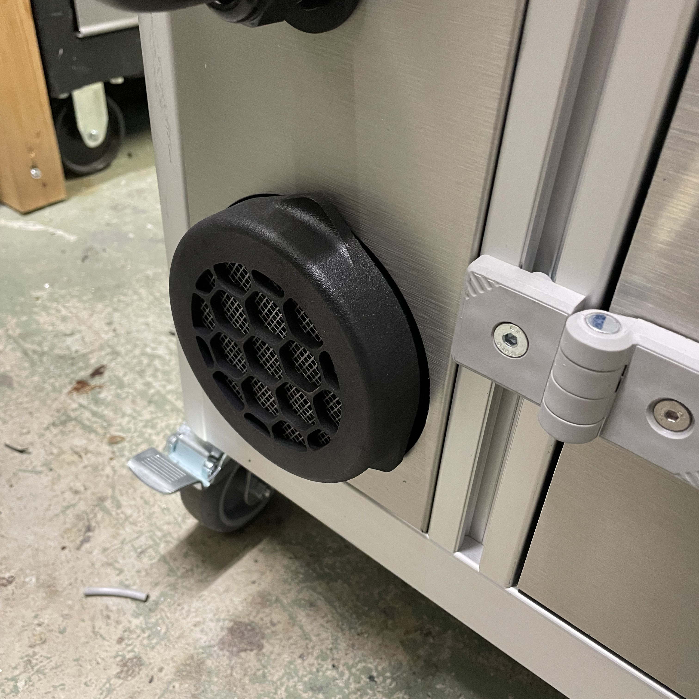
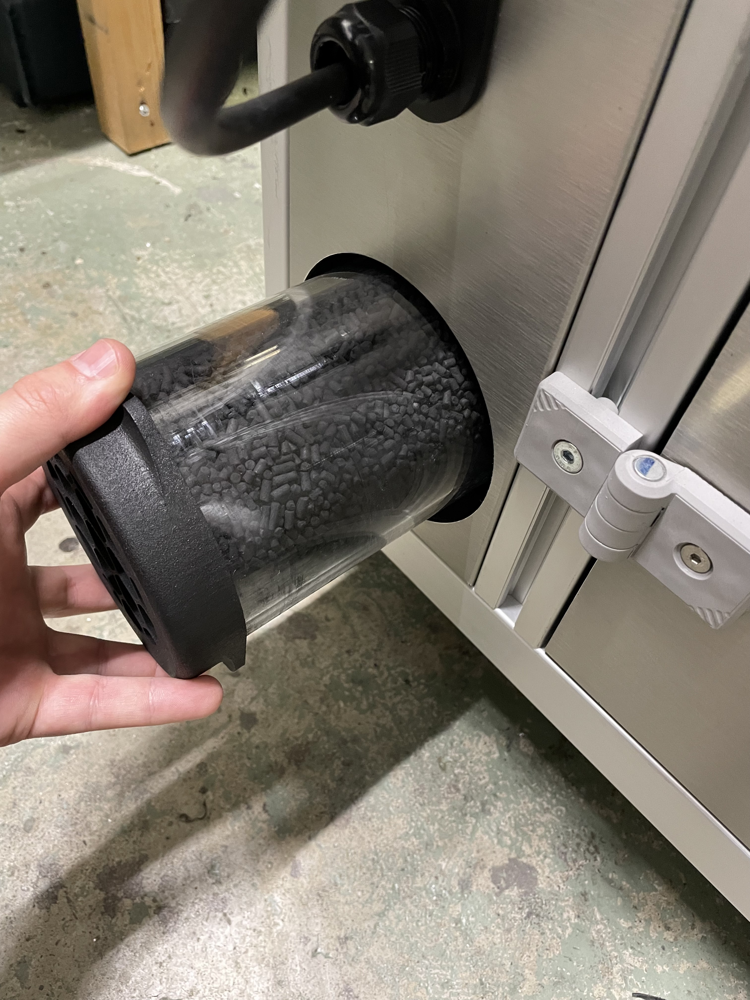
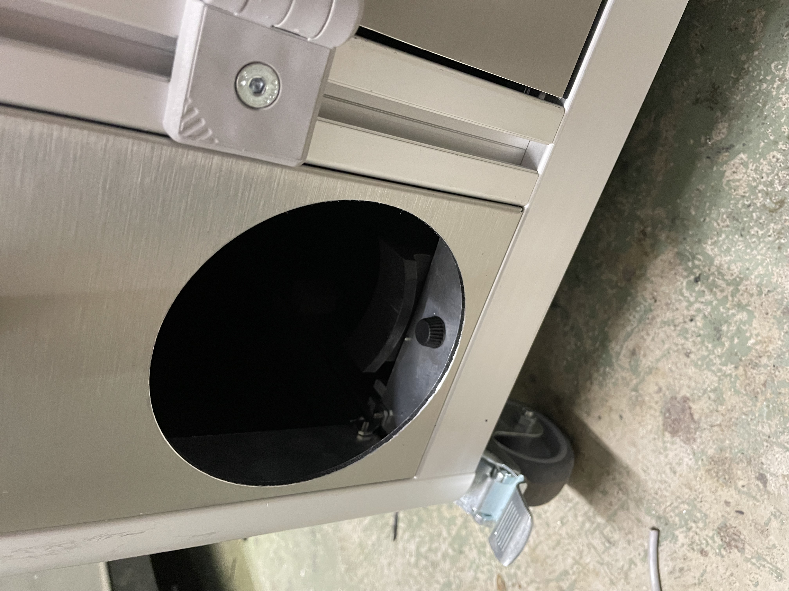

Dans un premier temps, le filtre de la Métalfog est situé sur le coté gauche de la machine.

Dévisser le filtre en effectuant une rotation anti-horaire. Quand le filtre est libéré sortez le de son logement.

Remplacer le filtre puis insérer le nouveau filtre en le vissant dans le sens horaire.
