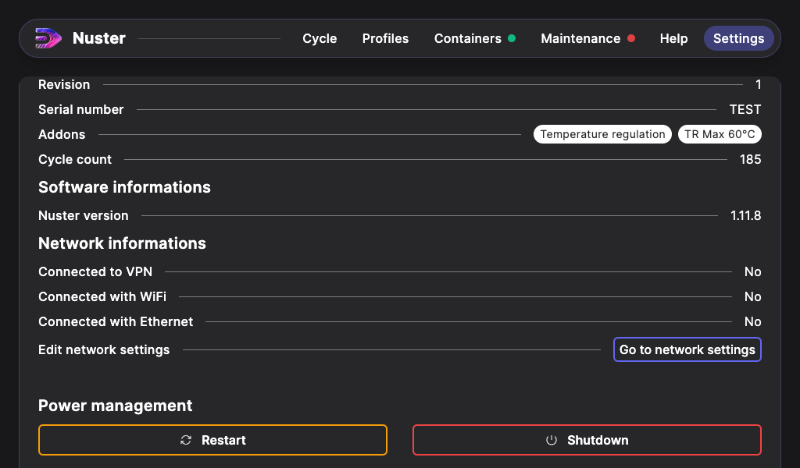

## Networking informations

To allow remote maintenance on your machine, you have to connect it to the internet. To do so, you can use the following methods:

- Connecting the RJ45 Jack located under the electric box,
- Connecting via Wifi network.

> Warning: It is not yet possible to set a static IPv4 address.

Network connection has some access requirements :

| Port | Description |
| --- | --- |
| 443 TCP | Allow remote connection to BalenaCloud VPN |
| 123 UDP | For NTP time synchronization |
| 53 UDP | For DNS name resolution |

Additionally, the following domains for the relevant ports above have to be allowed:

- *.balena-cloud.com

No direct connection is established between your device and our services. All connections are tunneled using a VPN.

### Wifi connection

Since Nuster 1.12.1, your machine can connect to Wifi networks. Click on the `Settings` tab to go to network settings.

Then click on `Go to network settings`.

In the network settings, you can find the 2 interfaces of your machine. The Wired interface, only displays informations about its connectivity.

The Wireless interface draws the available networks. The network list refreshes itself automaticaly or you can refresh the list manually by pressing the `Seek networks` button.

Click on the network you want to connect to. If the network is secured, a password will be asked.

