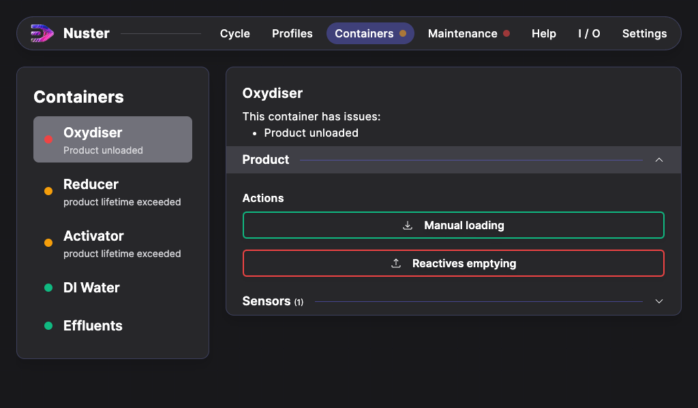
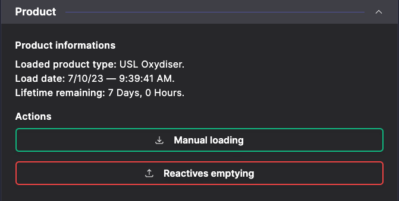
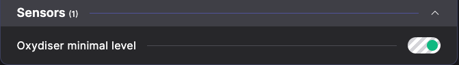
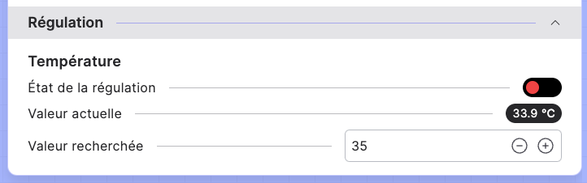

## Containers section

### General description

The container section handles container management of your machine :

- Product loaded in the machine,
- Sensors attached to this container,
- Regulations attached to this container.

Each container has differents configurations (product loadables, sensors attached, regulations attached or not)

### Product management

#### Product informations

When you load a product into the machine, the following informations are displayed:

- Loaded product type,
- Load date,
- Remaining optimal lifetime.

> **Warning**: Some products have no lifetime. The container will display a warning.

#### Product actions

Thanks to these actions, you can empty or load the products automatically or manually into the container. You will be guided by the software to handle product loading into your machine.

> **Warning:** Some actions can redirect you to a cycle that you will have to start to finish the product loading / unloading.

### Sensors

In this sub section, you will find all the attached sensors on this container.

### Regulation management

Here, you can edit the setpoint, by modify the `target value` and enable the regulation by setting the `regulation state` to true or false.

> **Warning:** The regulation is independant from the cycles, it keeps going in the background.
