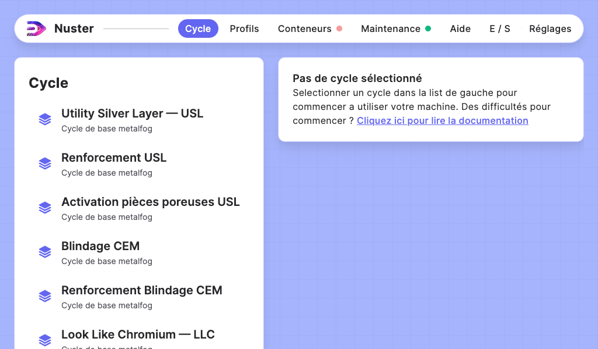

## Introduction

Bienvenue sur le guide d'utilisation de Nuster!

Nuster est l'interface Homme ↔ Machine qui vous permet de contrôler votre appareil !
Nuster est un logiciel polyvalent adapté à toutes les machines fabriquées par METALIZZ.

Vous trouverez ici les informations utiles pour prendre en main ce logiciel.

### Prise en main

Au démarrage de votre machine, vous trouverez l'interface principale.

L'interface est divisée en 3 blocs.

#### Bloc 1: Les onglets de navigation

Situés en haut de la fenêtre dans la barre horizontale, les onglets  permettent de naviguer à travers les sections du logiciel :

- Les [cycles](sections/00-cycles/index.md),
- Les [profils](sections/10-profiles/index.md) (cette option n'est pas disponible par défaut sur certaines machines),
- Les [conteneurs](sections/20-containers/index.md),
- La [maintenance](sections/30-maintenances/index.md),
- L'aide,
- Les [réglages](sections/40-settings/index.md).

Certains onglets sont accompagnés d'une pastille de couleur :

- **Rouge :** une action est requise dans cette section,
- **Orange :** un avertissement est présent dans cette section,
- **Vert :** rien à signaler dans cette section,
- **Bleu :** une nouvelle information est à consulter dans cette section.

#### Bloc 2: La liste

Située en vertical à gauche, la liste permet de sélectionner le contenu qui s'affichera à droite dans la partie principale. La liste peut parfois disparaitre pour que seul le contenu principal s'affiche.

#### Bloc 3: Partie principale

Située à droite, la partie principale est affichée en fonction de l'élément sélectionné dans la liste. 
Exemple : en sélectionnant un cycle dans la liste de gauche, le menu de lancement de ce cycle s'affichent dans la partie principal.