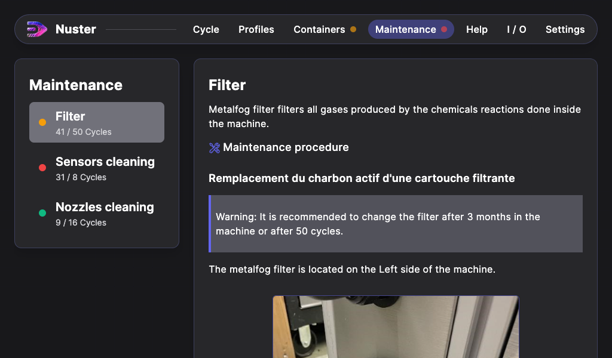
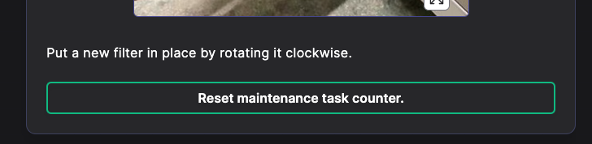

## Maintenance section

### General description

The section manages the maintenance tasks of your machines.

Each maintenance task in available in the left list. Its stat is given with a color:

- Green: Good to go,
- Orange: The maintenance should be planned (> 75%),
- Red: The maintenance task must be done.

Click on the maintenance task to show the task procedure to follow.

### Maintenance procedure

Each maintenance task is followed by its maintenance procedure.

At the end of the procedure, you will find the Validation button that resets the maintenance task counter to 0.

### Warning: Maintenance tasks attached to a sensor

Some maintenance tasks are attached to a sensor.
The maintenance task state depends on the sensor state.

> Example: the USCleaner filter.
