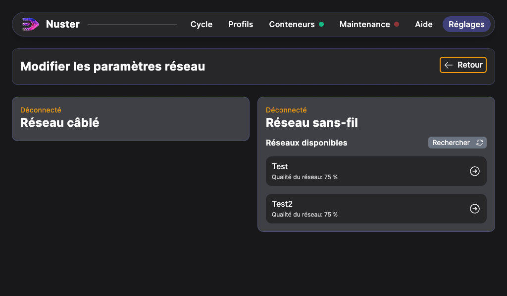

## Informations réseau

Pour permettre la télémaintenance de votre machine, il faut la connecter à votre réseau. Plusieurs méthodes sont possibles :

- Via le port RJ45, situé sous le coffret électrique,
- Via un réseau wifi.

> Attention: Il n'est pas encore possible d'assigner une adresse IPv4 fixe à la machine.

La connexion réseau nécessite l'accès aux ports sortants suivants :

| Port | Description |
| --- | --- |
| 443 TCP | Permet la connexion VPN Balena-Cloud |
| 123 UDP | Pour la synchronisation de la date et l'heure |
| 53 UDP | Pour la résolution DNS |

Elle nécessite aussi l'accès au domaine suivant:

- *.balena-cloud.com

Aucune connexion directe entre la machine et nos services n'est possible. Toutes les connexions sont sécurisées via un VPN.

### Connexion en WiFi

Depuis Nuster 1.12.1, votre machine peut se connecter aux réseaux WiFi. Pour ce faire, rendez vous dans l'onglet `Réglages`.

Puis cliquez sur `Aller aux paramètres réseau`.

Vous trouverez dans les paramètres réseau les deux interfaces réseau de votre machine. L'interface RJ45 affiche uniquement des informations sur sa connectivité.

L'interface wifi affiche une liste des réseaux disponibles à proximité. La liste se recharge automatiquement mais vous pouvez aussi la recharger manuellement en cliquant sur `Rechercher`.

Cliquez sur le réseau auquel vous souhaitez vous connecter. Si le réseau est sécurisé, un mot de passe vous sera demandé.

