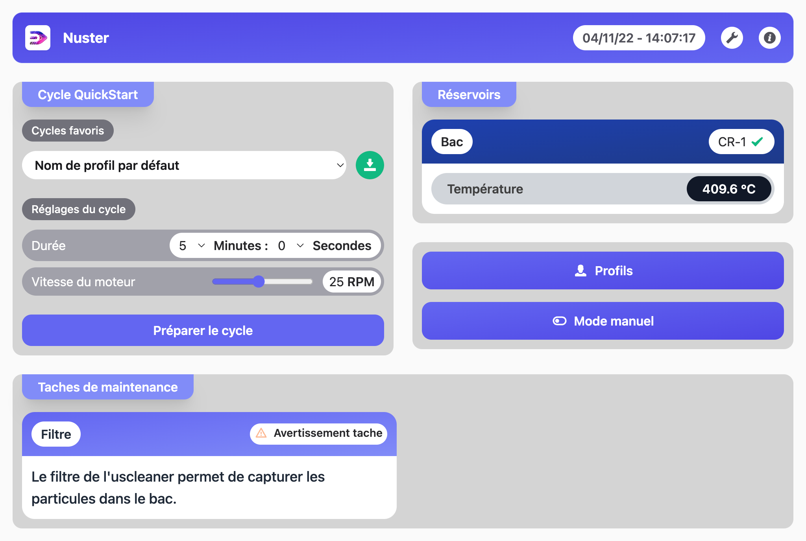

## Guide d'aide Nuster

### Introduction

Bienvenue sur le guide d'utilisation de Nuster! Vous trouverez ici diverses informations pour prendre en main le logiciel.
Nuster est l'interface Homme ↔ Machine qui vous permet de controller votre machine!

### Interface pricipale

Sur l'ecran principal vous trouverez toute les informations dont vous avez besoin.

### Barre de navigation

La barre de navigation possède plusieurs boutons

  - Le bouton d'[acces aux réglages](nav-modals/settings.md)
  - Les [informations machines](nav-modals/informations.md)
  - Les [informations réseau](nav-modals/network.md)
  - Le bouton d'accès au guide d'utilisation

### Composants

Nuster est décomposé en composants qui intéragissents entre eux pour faire fonctionner votre machines:

- [Cycles](components/cycle.md)
- [Profils](components/profiles.md)
- [Mode manuels](components/manual-modes.md)
- [Maintenances](components/maintenance.md)
- [Réservoirs](components/containers.md)
